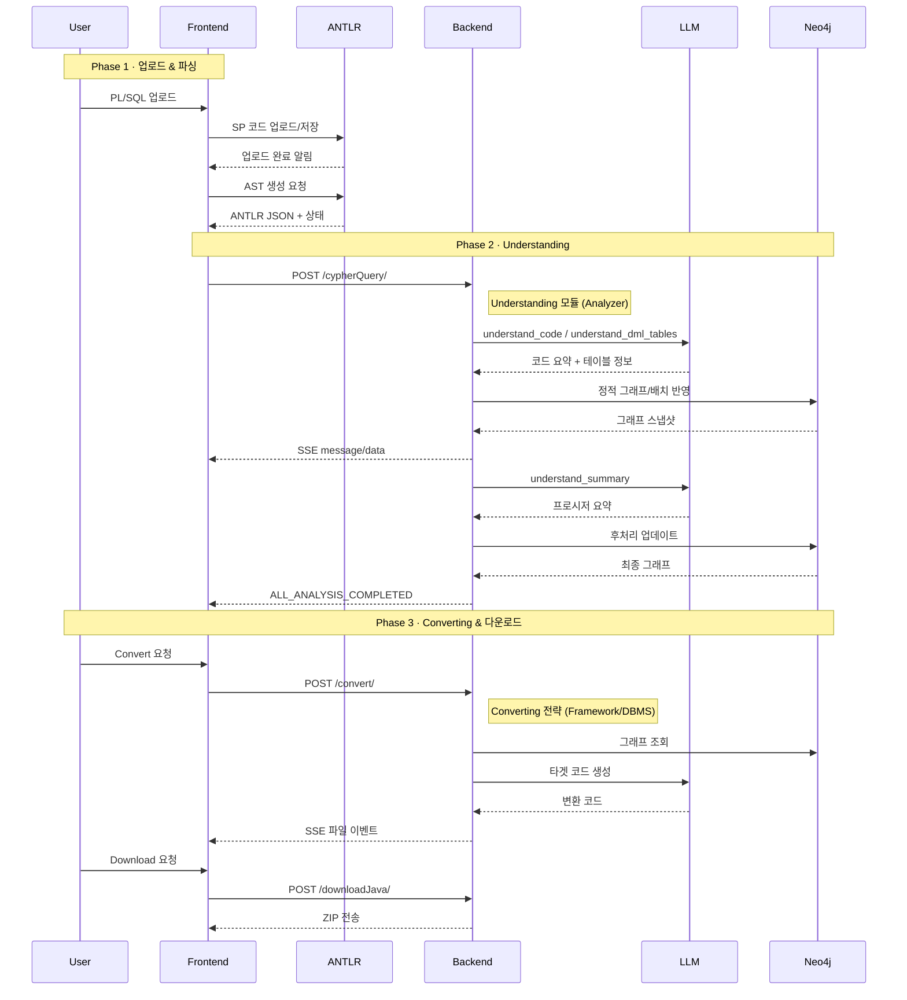

# Legacy Modernizer Backend

> **AI 기반 레거시 코드 현대화 플랫폼**
> 

[](https://fastapi.tiangolo.com/)
[](https://www.python.org/)
[](https://neo4j.com/)

---

## 목차

1. [프로젝트 개요](#1-프로젝트-개요)
2. [시스템 구조](#2-시스템-구조)
3. [전체 워크플로우](#3-전체-워크플로우)
4. [모듈 상세 설명](#4-모듈-상세-설명)
5. [설치 및 실행](#5-설치-및-실행)
6. [Neo4j 그래프 활용](#6-neo4j-그래프-활용)
7. [API 엔드포인트](#7-api-엔드포인트)
8. [추가 문서](#8-추가-문서)

---

## 1. 프로젝트 개요

### 1.1 Legacy Modernizer란?

Legacy Modernizer는 **레거시 코드를 단순히 전환하는 것이 아니라, 완전히 이해하고 재구성하는 AI 기반 현대화 플랫폼**입니다.

대부분의 코드 변환 도구는 단순히 문법을 치환하는 수준에 그치지만, Legacy Modernizer는 다릅니다:

- **코드의 의미를 이해합니다**: LLM을 활용하여 각 구문이 무엇을 하는지 이해합니다.
- **구조를 시각화합니다**: Neo4j 그래프로 코드 흐름, 테이블 관계 및 호출 관계를 보여줍니다
- **안전하게 전환합니다**: 그래프에 담긴 정보를 기반으로 타겟 코드를 생성합니다

```text
┌─────────────────────────────────────────────────────────────┐
│  "코드는 단순한 텍스트가 아니라 관계의 집합이다"             │
│                                                               │
│  레거시 코드의 흐름과 제약을 그래프로 옮겨야                  │
│  의미를 정확히 파악하고, 안전하게 현대화할 수 있다            │
└─────────────────────────────────────────────────────────────┘
```

### 1.2 왜 Legacy Modernizer가 필요한가?

#### 레거시 코드의 문제점

레거시 코드는 보통 다음과 같은 문제를 가지고 있습니다:

- **가독성 저하**: 의미 불명확한 변수명, 수천 라인의 복잡한 구조
- **유지보수 어려움**: 코드 간 의존성 파악 어려움, 영향도 분석 불가능
- **전환의 어려움**: 다른 DBMS나 프레임워크로 전환 시 수동 작업으로 인한 오류와 시간 소모

#### Legacy Modernizer의 해결책

Legacy Modernizer는 레거시 코드를 다음과 같이 개선합니다:

**1. 가독성 향상 및 시각화**
- LLM으로 각 코드 블록의 의미를 자연어로 요약하여 문서화
- Neo4j 그래프로 코드 구조와 관계를 시각화하여 한눈에 파악 가능

**2. 쉬운 전환**
- 수동 전환 대신 자동으로 타겟 DBMS나 프레임워크 코드 생성
- 그래프 기반 분석으로 정확하고 일관된 변환 보장
- 한 번 분석한 결과를 여러 타겟으로 재사용 가능

**효과**: 수작업으로 수주가 걸리던 전환 작업을 수분 내에 완료하고, 가독성과 유지보수성을 크게 향상시킵니다.

### 1.3 핵심 구조: 2단계 파이프라인

Legacy Modernizer는 **Understanding(이해)**과 **Converting(전환)** 두 모듈로 구성된 2단계 파이프라인입니다:

```text
┌─────────────────────────────────────────────────────────────┐
│                                                              │
│  PL/SQL → Understanding → Neo4j 그래프 → Converting → 타겟  │
│           (이해/분석)      (중간 표현)     (전환/생성)      │
│                                                              │
└─────────────────────────────────────────────────────────────┘
```

| 단계 | 역할 | 입력 | 출력 |
|------|------|------|------|
| **Understanding** | 레거시 코드를 완전히 이해하고 분석 | PL/SQL + ANTLR JSON | Neo4j 그래프 |
| **Converting** | 이해한 내용을 타겟 코드로 생성 | Neo4j 그래프 | Spring Boot / Oracle SQL |

**왜 2단계로 분리했는가?**
- **재사용성**: 한 번 Understanding 후 여러 타겟으로 변환 가능
- **정확성**: 의미를 완전히 이해한 후 변환하므로 단순 문법 치환보다 정확
- **확장성**: 새로운 타겟 추가 시 Converting 전략만 추가
- **검증 가능성**: Neo4j 그래프로 분석 결과를 시각화하여 검증

---

## 2. 시스템 구조

### 2.1 주요 특징과 장점

| 특징 | 기술적 구현 | 실질적 이점 |
|------|------------|------------|
| 🧠 **LLM 기반 의미 분석** | 각 구문의 자연어 요약 생성 | 레거시 코드의 비즈니스 로직 파악 |
| 🕸️ **Neo4j 그래프 저장** | 코드를 노드 및 관계 구조로 저장 | Cypher 쿼리로 프로시저 호출 체인, 테이블 영향도 분석 |
| 🔄 **분석-전환 분리** | 분석 단계에서 그래프 생성, 변환 단계에서 그래프를 읽어 코드 생성 | 한 번 분석한 결과를 여러 타겟 언어으로 전환 |
| ⚡ **배치 병렬 처리** | 최대 n개 배치 동시 처리, 각 배치마다 코드 요약과 테이블 메타데이터 추출을 병렬 실행 | 수천 라인 코드도 빠르게 분석 |
| 🎯 **전략 패턴 전환** | 프레임워크 변환과 DBMS 변환 로직을 독립적으로 분리 | 새로운 타겟 추가 시 기존 코드 수정 없이 변환 로직만 추가 |
| 🔍 **DML 메타데이터 추출** | DML 노드 분석으로 테이블명, 컬럼 타입, FK 관계 자동 추출 | 테이블 간 관계 정보를 Neo4j에서 조회 및 시각화 |

### 2.2 전체 아키텍처

Legacy Modernizer는 **Understanding(분석)**과 **Converting(변환)** 두 모듈로 구성되어 있으며, Neo4j 그래프를 중간 표현으로 사용합니다.

```text
┌──────────────────────────────────────────────────────────────┐
│                    Frontend (React)                           │
│  - 파일 업로드 / ANTLR 파싱                                   │
│  - SSE 스트리밍 / 그래프 시각화                               │
└───────────────────┬──────────────────────────────────────────┘
                    │ HTTP / SSE
┌───────────────────▼──────────────────────────────────────────┐
│                Backend (FastAPI)                              │
│                                                               │
│  ┌──────────────────────────────────────────────────────┐   │
│  │  service/router.py (API 엔드포인트)                  │   │
│  │  - POST /cypherQuery/  : Understanding              │   │
│  │  - POST /convert/      : Converting                 │   │
│  │  - POST /downloadJava/ : 결과 다운로드              │   │
│  └───────┬──────────────────────────┬───────────────────┘   │
│          │                          │                       │
│  ┌───────▼─────────┐       ┌────────▼──────────┐           │
│  │ Understanding   │       │ Converting         │           │
│  │ - analysis.py   │       │ - strategies/      │           │
│  │ - neo4j_conn.py │       │ - framework/       │           │
│  └───────┬─────────┘       │ - dbms/            │           │
│          │                 └────────┬───────────┘           │
│          │                          │                       │
│  ┌───────▼──────────────────────────▼───────────────────┐   │
│  │         prompt/ (LLM 프롬프트 템플릿)                │   │
│  └─────────────────────────────────────────────────────┘   │
└──────────────────┬──────────────────────────────────────────┘
                   │
┌──────────────────▼──────────────────────────────────────────┐
│              Neo4j Graph Database                            │
│  노드: PROCEDURE, SELECT, IF, Table, Column, Variable       │
│  관계: PARENT_OF, NEXT, FROM, WRITES, CALL, HAS_COLUMN     │
└──────────────────┬──────────────────────────────────────────┘
                   │
┌──────────────────▼──────────────────────────────────────────┐
│                 LLM API (GPT-4)                              │
│  - 코드 의미 분석 / 테이블 추출 / 타겟 코드 생성            │
└──────────────────────────────────────────────────────────────┘
```

### 2.3 각 모듈 간단 소개

#### Understanding (코드 이해 및 분석)
| 기능 | 설명 | 결과물 |
|------|------|--------|
| **코드 구조 분석** | ANTLR로 파싱한 구문 트리(JSON 형식)를 후위순회하여 코드 구조 수집 | 프로시저, 조건문, 반복문, DML 등 코드 구조를 그래프 노드로 저장 |
| **코드 의미 분석** | LLM으로 각 구문의 동작을 분석하여 코드 동작 요약, 변수/호출 관계 식별 | 각 코드 블록의 의미를 자연어 설명으로 저장하고, 관계를 그래프에 연결 |
| **테이블 정보 추출** | DML 문에서 사용된 테이블과 컬럼 정보 자동 추출 | 테이블과 컬럼을 노드로 저장하고, 읽기/쓰기 관계로 연결 |
| **프로시저 호출 관계** | 프로시저 간 호출 관계를 분석하여 그래프에 저장 | 어떤 프로시저가 어떤 프로시저를 호출하는지 관계로 표현 |
| **변수 타입 해석** | %ROWTYPE, %TYPE 등 복잡한 변수 타입을 실제 타입으로 해석 | 변수 정보를 노드로 저장하고 정확한 데이터 타입 포함 |

#### Converting (코드 변환 및 생성)
| 변환 타입 | 입력 | 출력 | 변환 방식 |
|---------|------|------|----------|
| **프레임워크 변환** | Neo4j 그래프 | 타겟 프레임워크 프로젝트 | 계층 구조 패턴 적용 (Entity → Repository → Service → Controller) |
| **DBMS 변환** | Neo4j 그래프 | 타겟 DBMS SQL 코드 | 문법 규칙 기반 변환 (Skeleton 생성 → 코드 변환 → 조립) |

---

## 3. 전체 워크플로우

### 3.1 순서도

```text
┌──────────────────────────────────────────────────────┐
│ 사용자: PL/SQL 파일 업로드                            │
└─────────────────┬────────────────────────────────────┘
                  ▼
┌──────────────────────────────────────────────────────┐
│ Frontend: ANTLR 파싱 → AST JSON 생성                 │
│           폴더 구성 (src/, analysis/, ddl/)          │
└─────────────────┬────────────────────────────────────┘
                  ▼
┌──────────────────────────────────────────────────────┐
│ Understanding: POST /cypherQuery/                    │
│                                                      │
│ 1. DDL 병렬 처리 (있는 경우)                         │
│ 2. AST 수집 → StatementNode 생성                     │
│ 3. 정적 그래프 초기화                                │
│ 4. 배치 플래닝 (토큰 기준)                           │
│ 5. LLM 병렬 호출 (최대 5개)                          │
│ 6. Neo4j 순차 반영                                   │
│ 7. 후처리 (요약, 타입 해석)                          │
└─────────────────┬────────────────────────────────────┘
                  ▼
┌──────────────────────────────────────────────────────┐
│ Neo4j: 그래프 완성                                   │
│        - 코드 구조 (노드/관계)                       │
│        - 의미 정보 (summary)                         │
│        - 메타데이터 (Table/Column)                   │
└─────────────────┬────────────────────────────────────┘
                  ▼
┌──────────────────────────────────────────────────────┐
│ Converting: POST /convert/                           │
│                                                      │
│ ▸ Framework 변환:                                    │
│   1. Entity 생성                                     │
│   2. Repository 생성                                 │
│   3. Service 생성                                    │
│   4. Controller 생성                                 │
│   5. Config 생성                                     │
│                                                      │
│ ▸ DBMS 변환:                                         │
│   1. Skeleton 생성                                   │
│   2. 규칙 기반 변환                                  │
│   3. 결과 조립                                       │
└─────────────────┬────────────────────────────────────┘
                  ▼
┌──────────────────────────────────────────────────────┐
│ 결과: ZIP 파일 다운로드                              │
│       - Spring Boot 프로젝트                         │
│       - 또는 변환된 SQL 파일                         │
└──────────────────────────────────────────────────────┘
```

### 3.2 시퀀스 다이어그램



---

## 4. 모듈 상세 설명

### 4.1 Understanding 모듈

Understanding은 **PL/SQL 코드를 입력받아 Neo4j 그래프로 변환하는 분석 엔진**입니다.

#### 주요 컴포넌트

| 컴포넌트 | 역할 |
|---------|------|
| **Analyzer** | 전체 파이프라인 제어 및 조율 |
| **StatementCollector** | ANTLR JSON 후위순회하여 StatementNode 생성 |
| **BatchPlanner** | 토큰 한도 기준으로 배치 생성 (기본 1000 토큰) |
| **LLMInvoker** | 병렬 LLM 호출 관리 (최대 5개 동시 실행) |
| **ApplyManager** | LLM 응답을 Neo4j에 순차 반영 |

#### 처리 흐름

```text
1. DDL 병렬 처리 (선택)
   └─> Table/Column 노드 생성

2. ANTLR JSON 로드 및 AST 수집
   └─> StatementNode 리스트 생성

3. 정적 그래프 초기화
   └─> 기본 노드 + PARENT_OF/NEXT 관계 생성

4. 배치 플래닝
   └─> 토큰 기준으로 배치 분할

5. LLM 병렬 호출
   └─> 각 배치마다 코드 요약 + 테이블 분석

6. Neo4j 순차 반영
   └─> 배치 ID 순서대로 적용

7. 후처리
   └─> 프로시저 요약 + 변수 타입 해석
```

**📘 상세 내용**: [understanding.md](./understanding.md) 참고

### 4.2 Converting 모듈

Converting은 **Neo4j 그래프를 입력받아 타겟 언어/DBMS 코드를 생성하는 변환 엔진**입니다.

#### 전략 패턴 구조

```text
         ConversionStrategy (추상)
                  │
        ┌─────────┴─────────┐
        │                   │
FrameworkStrategy    DbmsStrategy
        │                   │
    ┌───┴───┐           ┌───┴───┐
    │       │           │       │
 Spring  FastAPI    Oracle  Postgres
  Boot    (TODO)
```

#### 변환 타입별 처리

**Framework 변환 (Spring Boot)**

```text
1. Entity 생성 (프로젝트 전체, 1회)
   └─> Table 노드 → JPA Entity

2. Repository 생성 (프로젝트 전체, 1회)
   └─> DML 노드 → Repository 메서드

3. Service Skeleton 생성 (파일별)
   └─> PROCEDURE 노드 → Service 클래스 틀

4. Service Body 생성 (파일별)
   └─> 그래프 순회하여 비즈니스 로직 완성

5. Controller 생성 (파일별)
   └─> SPEC 노드 → REST API 엔드포인트

6. Config 생성 (프로젝트 전체, 1회)
   └─> pom.xml, application.yml
```

**DBMS 변환 (PostgreSQL → Oracle)**

```text
1. Skeleton 생성
   └─> SPEC/DECLARE 노드 → 프로시저 시그니처

2. Conversion (배치 누적 방식)
   └─> 그래프 순회 + 규칙 JSON 참조
   └─> 토큰 한도 도달 시 LLM 호출

3. 결과 조립
   └─> Skeleton에 변환 코드 삽입
```

**📗 상세 내용**: [converting.md](./converting.md) 참고

---

## 5. 설치 및 실행

### 5.1 필수 소프트웨어

| 소프트웨어 | 버전 | 다운로드 링크 |
|-----------|------|-------------|
| **Python** | 3.10+ | [python.org](https://www.python.org/downloads/) |
| **Neo4j Desktop** | 5.x | [neo4j.com/download](https://neo4j.com/download/) |
| **LLM API Key** | - | OpenAI / Anthropic |

### 5.2 Neo4j 설치 및 설정

1. **Neo4j Desktop 다운로드 및 설치**
   - [https://neo4j.com/download/](https://neo4j.com/download/)
   - 무료 Community Edition 사용 가능

2. **데이터베이스 생성**
   ```
   - New Project 생성
   - Add → Local DBMS
   - Name: legacy-modernizer
   - Password: 설정 (예: neo4j123)
   - Version: 5.x 선택
   - Create
   ```

3. **데이터베이스 시작**
   - Start 버튼 클릭
   - 상태가 "Active"가 될 때까지 대기

4. **연결 확인**
   - Open 버튼 클릭 → Neo4j Browser 실행
   - `bolt://localhost:7687` 주소 확인

### 5.3 Python 환경 설정

#### 방법 1: uv 사용 (권장)

```bash
# 1. 저장소 클론
git clone <repository-url>
cd backend

# 2. uv로 가상 환경 생성
uv venv

# 3. 가상 환경 활성화
# Windows (Git Bash)
source .venv/Scripts/activate
# Windows (PowerShell)
.venv\Scripts\Activate.ps1
# macOS/Linux
source .venv/bin/activate

# 4. 의존성 설치
uv pip install -r requirements.txt

# 가상 환경 비활성화 (작업 종료 시)
deactivate
```

#### 방법 2: pipenv 사용

```bash
# 1. 저장소 클론
git clone <repository-url>
cd backend

# 2. pipenv 환경 생성 및 활성화
pipenv shell

# 3. 의존성 설치
pipenv install

# 가상 환경 비활성화 (작업 종료 시)
exit
```

### 5.4 환경 변수 설정

프로젝트 루트에 `.env` 파일 생성:

```bash
# Neo4j 연결 정보
NEO4J_URI=bolt://localhost:7687
NEO4J_USER=neo4j
NEO4J_PASSWORD=password

# LLM API 설정
LLM_API_KEY=sk-your-openai-api-key
LLM_API_BASE=https://api.openai.com/v1
LLM_MODEL=model-name
LLM_MAX_TOKENS=max-token

# 병렬 처리 설정 (선택)
MAX_CONCURRENCY=5              # LLM 배치 병렬 실행 개수
DDL_MAX_CONCURRENCY=5          # DDL 파일 병렬 처리 개수
VARIABLE_CONCURRENCY=5         # 변수 선언 병렬 분석 개수
MAX_BATCH_TOKEN=1000           # 배치당 최대 토큰 수
```

### 5.5 데이터 폴더 구조

프로젝트 실행 시 다음과 같은 폴더 구조가 사용됩니다:

```text
data/
└── {user_id}/
    └── {project_name}/
        ├── src/                  # PL/SQL 원본 파일
        │   └── {system_name}/
        │       └── *.sql
        ├── analysis/             # ANTLR AST JSON
        │   └── {system_name}/
        │       └── *.json
        └── ddl/                  # DDL 파일 (선택)
            └── *.sql
```

- `src/`: ANTLR 서버에서 업로드된 PL/SQL 원본 파일 저장
- `analysis/`: ANTLR 서버가 생성한 AST JSON 파일 저장
- `ddl/`: 테이블 스키마 정의 DDL 파일 (선택사항)

### 5.6 서버 실행

```bash
# 서버 시작
python main.py
```

서버가 `http://localhost:5502`에서 실행됩니다.

**참고**: 코드 변경 시 자동 재시작이 필요하면 다음 명령어를 사용할 수 있습니다:
```bash
uvicorn main:app --reload --port 5502
```

### 5.7 테스트 실행

VS Code에서 테스트를 실행하는 방법:

1. **Python 확장팩 설치**
   - VS Code 확장팩 마켓플레이스에서 "Python Test Explorer for Visual Studio" 설치

2. **테스트 설정 파일 생성**

   프로젝트 루트에 `.vscode` 폴더를 생성하고 다음 설정 파일을 추가하세요:

   **`.vscode/settings.json`**:
   ```json
   {
       "python.testing.pytestArgs": [
           "test"
       ],
       "python.testing.unittestEnabled": false,
       "python.testing.pytestEnabled": true
   }
   ```

   **`.vscode/launch.json`** (디버깅용, 선택):
   ```json
   {
       "version": "0.2.0",
       "configurations": [
           {
               "name": "Python Debugger: Current File",
               "type": "debugpy",
               "request": "launch",
               "program": "${file}",
               "console": "integratedTerminal"
           },
           {
               "name": "Pytest: Debug Current File",
               "type": "debugpy",
               "request": "launch",
               "module": "pytest",
               "args": [
                   "${file}",
                   "-s"
               ],
               "console": "integratedTerminal",
               "justMyCode": false
           }
       ]
   }
   ```

3. **테스트 실행**
   - **전체 테스트**: 사이드바의 "테스트" 아이콘 클릭 → 테스트 하고 싶은 메서드 실행 
   - **특정 파일**: 테스트 파일을 열면 각 테스트 메서드 옆에 ▶️ 실행 버튼이 표시됩니다
   - **특정 테스트**: 각 테스트 메서드 위의 ▶️ 버튼 클릭

---

## 6. Neo4j 그래프 활용

### 6.1 노드 타입

Understanding이 생성하는 노드 타입:

| 노드 타입 | 역할 | 주요 속성 |
|----------|------|----------|
| **SYSTEM** | 폴더/모듈 그룹 | `user_id`, `project_name`, `name` |
| **FILE** | 소스 파일 | `user_id`, `project_name`, `system_name`, `file_name` |
| **PROCEDURE** | 프로시저 | `procedure_name`, `summary`, `startLine`, `endLine` |
| **FUNCTION** | 함수 | `procedure_name`, `summary`, `startLine`, `endLine` |
| **TRIGGER** | 트리거 | `procedure_name`, `summary` |
| **SELECT** | SELECT 문 | `summary`, `node_code`, `startLine`, `endLine` |
| **INSERT** | INSERT 문 | `summary`, `node_code`, `startLine`, `endLine` |
| **UPDATE** | UPDATE 문 | `summary`, `node_code`, `startLine`, `endLine` |
| **DELETE** | DELETE 문 | `summary`, `node_code`, `startLine`, `endLine` |
| **MERGE** | MERGE 문 | `summary`, `node_code` |
| **IF** | 조건문 | `summary`, `condition` |
| **LOOP** | 반복문 | `summary` |
| **WHILE** | WHILE 문 | `summary`, `condition` |
| **FOR** | FOR 문 | `summary` |
| **Table** | 테이블 | `user_id`, `project_name`, `schema`, `name`, `description` |
| **Column** | 컬럼 | `user_id`, `project_name`, `fqn`, `name`, `dtype`, `nullable` |
| **Variable** | 변수 | `name`, `type`, `parameter_type` |
| **PACKAGE_VARIABLE** | 패키지 변수 | `name`, `type` |

### 6.2 관계 타입

| 관계 | 시작 노드 | 끝 노드 | 의미 |
|------|----------|---------|------|
| **PARENT_OF** | 부모 구조 | 자식 구조 | 계층 관계 (프로시저 > IF > SELECT) |
| **NEXT** | 이전 구문 | 다음 구문 | 실행 순서 (SELECT → UPDATE) |
| **FROM** | SELECT | Table | 테이블 읽기 |
| **WRITES** | INSERT/UPDATE/DELETE | Table | 테이블 쓰기 |
| **CALL** | 호출자 | PROCEDURE/FUNCTION | 프로시저 호출 |
| **HAS_COLUMN** | Table | Column | 테이블이 컬럼 포함 |
| **SCOPE** | Variable | DECLARE/SPEC | 변수 스코프 |
| **USES** | 구문 | Variable | 변수 사용 |
| **FK_RELATION** | Column | Column | 외래키 참조 관계 |

### 6.3 실전 쿼리

#### 전체 노드 조회

```cypher
// 특정 사용자의 모든 노드 조회
MATCH (n {user_id: 'test_user'})
RETURN n
```

#### 전체 데이터 삭제

```cypher
// 특정 사용자의 모든 노드와 관계 삭제
MATCH (n {user_id: 'test_user'})
DETACH DELETE n
```

#### 프로시저 목록 조회

```cypher
MATCH (p:PROCEDURE {user_id: 'test_user', project_name: 'my_project'})
RETURN p
```

---

## 7. API 엔드포인트

### 7.1 Understanding (분석 시작)

**엔드포인트**: `POST /cypherQuery/`

**요청 헤더**:
```http
Session-UUID: test_user
OpenAI-Api-Key: sk-your-api-key
Accept-Language: ko  # 선택 (기본값: ko)
```

**요청 본문**:
```json
{
  "projectName": "my_project",
  "dbms": "postgres",
  "targetLang": "java",
  "systems": [
    {
      "name": "order_system",
      "sp": ["proc_create_order.sql", "proc_cancel_order.sql"]
    },
    {
      "name": "payment_system",
      "sp": ["proc_process_payment.sql"]
    }
  ]
}
```

**파라미터 설명**:
- `projectName` (필수): 프로젝트 이름
- `dbms` (선택): 소스 DBMS 타입 (`postgres`, `oracle` 등, 기본값: `postgres`)
- `targetLang` (선택): 변환 결과에서 사용할 기본 언어 (`java`, `python` 등, 기본값: `java`)
- `systems` (필수): 분석할 폴더와 파일 목록
  - `name`: 폴더 이름 (시스템/모듈 구분)
  - `sp`: SQL 파일명 배열

**응답 형식**: **Server-Sent Events (SSE)**

- `type` 필드는 항상 `message` · `data` · `status` · `error` 중 하나입니다.
- 진행 상황 안내(`Preparing Analysis Data`, `START DDL PROCESSING: ...` 등)는 `type: "message"`로 전달됩니다.
- 그래프/라인 진행률은 `type: "data"`에 `graph`, `line_number`, `analysis_progress`, `current_file` 필드로 내려옵니다.
- 오류 발생 시 `type: "error"` 이벤트 하나를 보낸 뒤 스트림이 종료됩니다.

```text
data: {"type": "message", "content": "Preparing Analysis Data"}

data: {"type": "message", "content": "START DDL PROCESSING: tables.sql"}

data: {"type": "data", "graph": {...}, "line_number": 120, "analysis_progress": 34, "current_file": "order_system-proc.sql"}

data: {"type": "message", "content": "ALL_ANALYSIS_COMPLETED"}
```

**에러 응답**:
```text
data: {"type": "error", "content": "UnderstandingError: API 키가 유효하지 않습니다."}
```

### 7.2 Converting (변환 시작)

**엔드포인트**: `POST /convert/`

**요청 헤더**:
```http
Session-UUID: test_user
OpenAI-Api-Key: sk-your-api-key
Accept-Language: ko
```

**요청 본문 (Framework 변환)**:
```json
{
  "projectName": "my_project",
    "dbms": "postgres",
  "targetLang": "java",
  "conversionType": "framework",
  "targetFramework": "springboot",
    "systems": [
      {
      "name": "order_system",
      "sp": ["proc_create_order.sql"]
    }
  ]
}
```

**요청 본문 (DBMS 변환)**:
```json
{
  "projectName": "my_project",
  "dbms": "postgres",
  "targetLang": "java",
  "conversionType": "dbms",
  "targetDbms": "oracle",
    "systems": [
      {
      "name": "order_system",
      "sp": ["proc_create_order.sql"]
    }
  ]
}
```

**파라미터 설명**:
- `conversionType` (필수): 변환 타입 (`framework` 또는 `dbms`)
- `targetFramework` (framework일 때 필수): 타겟 프레임워크 (`springboot`, 향후 `fastapi`)
- `targetDbms` (dbms일 때 필수): 타겟 DBMS (`oracle`, `postgres`)
- `targetLang` (선택): 생성 코드 기본 언어 (`java`, `python` 등, 기본값: `java`)

**응답 형식**: **Server-Sent Events (SSE)**

- Understanding과 동일하게 `type`은 `message` · `data` · `status` · `error` 중 하나입니다.
- 단계 완료 신호는 `type: "status"`로 내려오며 `step` 번호와 `done` 여부를 포함합니다.
- 생성된 코드 조각은 `type: "data"`에 `file_type`, `file_name`, `code` 필드로 전달됩니다.

```text
data: {"type": "message", "content": "Starting framework conversion"}

data: {"type": "status", "step": 1, "done": true}

data: {"type": "data", "file_type": "entity_class", "file_name": "OrderEntity.java", "code": "<생성된 코드>"}

data: {"type": "message", "content": "Generating Config Files"}

data: {"type": "status", "step": 5, "done": true}
```

### 7.3 다운로드 (결과 다운로드)

**엔드포인트**: `POST /downloadJava/`

**요청 헤더**:
```http
Session-UUID: test_user
```

**요청 본문**:
```json
{
  "projectName": "my_project"
}
```

**응답 형식**: **ZIP 파일 (application/octet-stream)**

```
Content-Type: application/octet-stream
Content-Disposition: attachment; filename="my_project.zip"

[ZIP 파일 바이너리 데이터]
```

**ZIP 파일 구조 (Spring Boot)**:
```
my_project.zip
└── my_project/
    ├── pom.xml
    ├── src/
    │   ├── main/
    │   │   ├── java/com/example/demo/
    │   │   │   ├── DemoApplication.java
    │   │   │   ├── entity/
    │   │   │   ├── repository/
    │   │   │   ├── service/
    │   │   │   ├── controller/
    │   │   │   └── dto/
    │   │   └── resources/
    │   │       └── application.yml
    │   └── test/
    └── README.md
```

### 7.4 데이터 삭제 (정리)

**엔드포인트**: `DELETE /deleteAll/`

**요청 헤더**:
```http
Session-UUID: test_user
```

**응답 형식**: **JSON**

```json
{
  "message": "모든 임시 파일이 삭제되었습니다."
}
```

**삭제되는 데이터**:
- Neo4j 그래프 노드 및 관계 (해당 사용자의 모든 데이터)
- 로컬 파일 시스템 임시 파일 (`data/{user_id}/`)
- 변환 결과 파일 (`target/java/{user_id}/`)

### 7.5 에러 응답 형식

모든 엔드포인트는 에러 발생 시 다음 형식으로 응답합니다:

**HTTP 4xx/5xx + JSON**:
```json
{
  "detail": {
    "error": "오류 메시지",
    "type": "UnderstandingError",
    "traceback": "..."
  }
}
```

**일반적인 에러 코드**:
- `400`: 잘못된 요청 (필수 파라미터 누락, 잘못된 형식)
- `401`: 인증 실패 (API 키 오류)
- `404`: 리소스 없음 (파일 없음, 프로젝트 없음)
- `500`: 서버 내부 오류 (Neo4j 연결 실패, LLM 호출 실패)

---

## 8. 추가 문서

각 모듈의 상세한 내부 동작과 구현 세부사항은 별도 문서를 참고하세요:

### 📘 Understanding 모듈 상세 가이드
**[understanding.md](./understanding.md)**

**주요 내용**:
- StatementCollector 후위순회 알고리즘
- BatchPlanner 토큰 기반 배치 분할 로직
- LLMInvoker 병렬 호출 메커니즘 (세마포어 활용)
- ApplyManager 순서 보장 및 동기화
- 각 프롬프트 템플릿 구조 및 용도
- 변수 타입 해석 (%ROWTYPE, %TYPE)
- DDL 병렬 처리 흐름
- 전체 파이프라인 시퀀스 다이어그램

### 📗 Converting 모듈 상세 가이드
**[converting.md](./converting.md)**

**주요 내용**:
- 전략 패턴 구현 상세 (StrategyFactory, BaseStrategy)
- Framework 변환 단계별 로직 (Entity → Repository → Service → Controller)
- DBMS 변환 스켈레톤 생성 및 코드 조립
- 규칙 JSON 파일 구조 및 활용
- 생성기 클래스 내부 동작 (EntityGenerator, ServiceGenerator 등)
- 배치 누적 방식 코드 변환
- 전체 변환 프로세스 시퀀스 다이어그램

---

**작성일**: 2025-12-04  
**버전**: 4.0.0  
**작성자**: Legacy Modernizer Team
**문의**: ahnpybara@uengine.org
