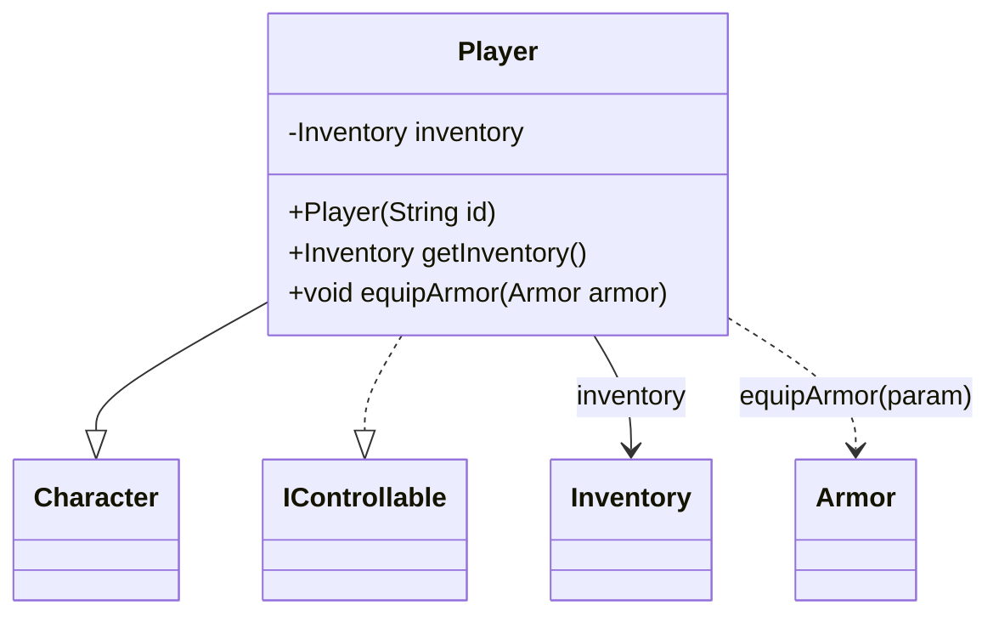

# ANTLR → Understanding → UML(Mermaid) 생성/확장: 가치 흐름(큰 틀)

이 문서는 **UI 동작 설명 없이**, “Java 코드를 시스템이 이해 가능한 구조로 바꾸고(ANTLR) → 관계 그래프로 연결해 보고(Understanding) → 관심 지점을 UML(Mermaid)로 정밀 확대”하기까지의 흐름을 **사용자가 얻는 가치 중심**으로 요약합니다.

---

## 1) 큰 그림: 사용자가 얻는 최종 가치

- **텍스트(Java 파일)**를 그대로 읽는 수준을 넘어, **구조(클래스/메서드/필드/상속)와 관계(연결)**로 이해할 수 있게 됩니다.
- 전체 구조는 **그래프(넓은 시야)**로, 관심 지점은 **UML(정밀한 시야)**로 단계적으로 확대합니다.
- 결과적으로 사용자는 “어디가 핵심인지 / 어떤 클래스가 어떤 역할인지 / 무엇과 무엇이 연결되는지”를 빠르게 파악할 수 있습니다.

---

## 2) 단계 1 — ANTLR 파싱: “형태화”의 가치

### 사용자가 얻는 가치

- Java 소스가 “그냥 문자열”이 아니라, **분석 가능한 구조 데이터(AST)**로 바뀝니다.
- 이후 단계(관계 추출/요약/그래프 반영/UML 생성)가 **안정적으로 동작할 수 있는 기반**이 생깁니다.

### 이 단계가 필요한 이유

- 그래프/UML은 “문장”이 아니라 “구조”가 필요합니다.
- 파싱은 구조를 표준 형태로 정리해, 이후 분석이 “파일마다 들쭉날쭉”해지는 위험을 줄입니다.

---

## 3) 단계 2 — Understanding(구조 연결): “넓게 보기”의 가치

### 사용자가 얻는 가치

- 프로젝트 내부 요소(클래스/인터페이스/필드/메서드 등)가 **노드**로 정리되고,
- 상속/구현/연관/호출 같은 연결이 **관계**로 만들어져
- “코드베이스가 어떤 모양인지”를 **한눈에 탐색 가능한 형태**로 얻게 됩니다.

### 이 단계가 하는 일(가치 관점)

- **정적 구조의 토대 만들기**: 중요한 구성 요소를 일관된 단위로 정리합니다.
- **연결 만들기**: 상속/구현, 필드 기반 연관, 로컬 의존, 호출 관계 등을 “그래프에서 볼 수 있는 연결”로 만듭니다.
- **요약으로 압축**: 각 구간/노드의 역할을 짧게 정리해 탐색 비용을 낮춥니다.

---

## 4) 단계 3 — UML(Mermaid) 생성: “관심 지점 정밀 확대”의 가치

### 사용자가 얻는 가치

- 그래프에서 관심 있는 클래스(또는 주변 관계)를 선택하면,
- 해당 지점을 중심으로 **UML(클래스 다이어그램)**을 생성해
- “필드/메서드/관계”를 더 **정밀하게 읽을 수 있는 뷰**를 얻습니다.

### UML이 그래프와 다른 이유(가치 관점)

- 그래프는 “연결을 넓게 탐색”하기 좋고,
- UML은 “한 클래스 중심으로 구조를 정밀하게 읽기” 좋습니다.
- 사용자는 둘을 번갈아 쓰며 **전체→국소**로 이해를 진행합니다.

---

## 5) 단계 4 — UML 확장: “점진적 이해 확대”의 가치

### 사용자가 얻는 가치

- UML에서 더 알고 싶은 클래스가 생기면,
- 그 클래스를 포함하도록 다이어그램을 확장해
- “이해 범위”를 단계적으로 넓힙니다.

### 왜 확장이 중요한가

- 대규모 레거시는 한 번에 전부를 그리면 복잡도가 폭발합니다.
- 확장은 사용자가 “지금 필요한 만큼만” 구조를 늘려가며 학습하도록 돕습니다.

---

## 6) 최종 요약(한 줄)

**ANTLR로 구조를 만들고 → Understanding으로 연결을 만들고 → UML로 관심 지점을 정밀 확대/확장**하는 흐름입니다.

---

## 7) “눈으로 보는 흐름” 샘플 (Java → AST(JSON) → Graph → UML)

아래는 하나의 아주 작은 예시로, 같은 대상이 **어떤 형태로 변환되며 가치가 누적되는지**를 보여줍니다.

### 7-A. 입력(Java) 샘플: 사람이 쓰는 코드

```java
package game;

public class Player extends Character implements IControllable {
    private final Inventory inventory;

    public Player(String id) {
        super(id);
        this.inventory = new Inventory(60);
    }

    public Inventory getInventory() { return inventory; }
    public void equipArmor(Armor armor) { inventory.equip(armor); }
}
```

사용자 가치:
- “코드가 무엇을 하는지”는 알 수 있지만, 전체 구조/관계는 파일을 넘나들며 직접 추론해야 합니다.

---

### 7-B. ANTLR 파싱 결과(AST) 샘플: 구조로 바뀐 형태

```json
{
  "type": "FILE",
  "startLine": 0,
  "endLine": 0,
  "children": [
    { "type": "PACKAGE", "startLine": 1, "endLine": 1, "children": [] },
    { "type": "CLASS", "startLine": 3, "endLine": 11, "children": [
      { "type": "EXTENDS", "startLine": 3, "endLine": 3, "children": [] },
      { "type": "IMPLEMENTS", "startLine": 3, "endLine": 3, "children": [] },
      { "type": "FIELD", "startLine": 4, "endLine": 4, "children": [] },
      { "type": "CONSTRUCTOR", "startLine": 6, "endLine": 9, "children": [
        { "type": "ASSIGN", "startLine": 8, "endLine": 8, "children": [] }
      ]},
      { "type": "METHOD", "startLine": 11, "endLine": 11, "children": [] }
    ]}
  ]
}
```

사용자 가치:
- “텍스트”가 아니라 “블록/관계 후보”로 정리되어, 이후 단계에서 일관되게 처리할 기반이 됩니다.

---

### 7-C. Understanding 결과(그래프) 샘플: 구조를 “연결”해서 넓게 보기

아래는 “그래프에 들어가는 핵심 정보”를 단순화한 예시입니다.

```json
{
  "nodes": [
    { "label": "CLASS", "startLine": 3, "endLine": 11, "name": "Player", "class_name": "Player", "file_name": "game-Player.java" },
    { "label": "CLASS", "name": "Character", "class_name": "Character" },
    { "label": "INTERFACE", "name": "IControllable", "class_name": "IControllable" },
    { "label": "FIELD", "startLine": 4, "endLine": 4, "name": "inventory", "field_type": "Inventory", "target_class": "Inventory" },
    { "label": "METHOD", "startLine": 11, "endLine": 11, "name": "getInventory", "return_type": "Inventory", "method_type": "getter" }
  ],
  "relationships": [
    { "type": "INHERITANCE", "from": "Player", "to": "Character" },
    { "type": "IMPLEMENTS", "from": "Player", "to": "IControllable" },
    { "type": "ASSOCIATION", "from": "Player", "to": "Inventory", "source_member": "inventory" }
  ]
}
```

사용자 가치:
- 전체 구조가 “연결된 지도”가 됩니다. 사용자는 이제 파일을 넘기지 않고도 관계를 탐색할 수 있습니다.

---

### 7-D. UML(Mermaid) 샘플: 관심 지점을 정밀 확대



사용자 가치:
- 그래프의 “넓은 시야”에서, 특정 클래스 주변을 “정밀 도면”으로 확대합니다.

---

## 8) 확장(UML 확대)의 의미(샘플)

UML에서 `Inventory`가 더 궁금해졌다고 가정하면, 다이어그램을 “Inventory까지 포함”하도록 확장합니다.
사용자는 한 번에 전체를 다 보지 않고 **필요한 만큼만** 이해 범위를 넓힙니다.


