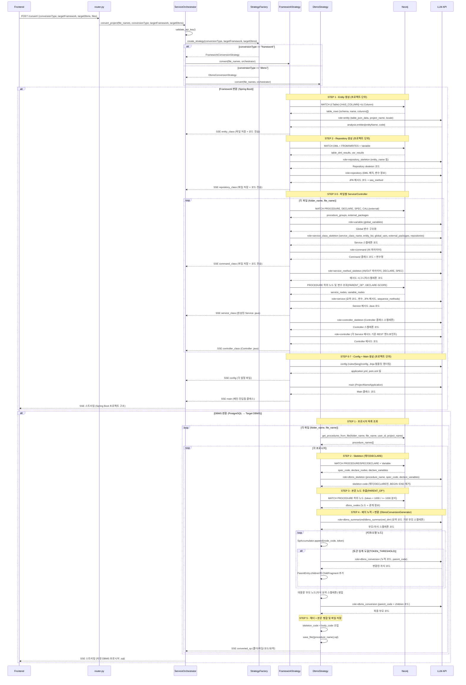

## Converting 모듈 - 로직 흐름 가이드

> **Neo4j 그래프(Understanding 결과)를 타겟 언어/DBMS 코드로 변환하는 Converting 파이프라인의 실제 구현 기준 가이드입니다.**
> 
> 이 문서는 Converting 모듈의 전략 패턴 구조, 각 변환 타입별 처리 로직, 생성기 클래스의 동작 원리를 상세히 설명합니다.

---

## 목차

1. [Converting 파이프라인 개요](#1-converting-파이프라인-개요)
2. [전략 패턴 구조](#2-전략-패턴-구조)
3. [Framework 변환 상세](#3-framework-변환-상세)
4. [DBMS 변환 상세](#4-dbms-변환-상세)
5. [생성기 클래스 상세](#5-생성기-클래스-상세)
6. [규칙 기반 변환](#6-규칙-기반-변환)
7. [시퀀스 다이어그램](#7-시퀀스-다이어그램)

---

## 1. Converting 파이프라인 개요

### 1.1 전체 흐름

Converting은 `/convert/` API에서 시작되어, ServiceOrchestrator가 StrategyFactory를 통해 변환 타입별 전략을 선택하고, 각 전략이 Neo4j 그래프를 읽어 실제 코드를 만들어내는 구조입니다.  
Framework 변환은 Spring Boot 프로젝트 구조를 생성하고, DBMS 변환은 PostgreSQL → Oracle 등 DBMS 간 프로시저 코드를 생성합니다.

```text
Neo4j 그래프 (Understanding 결과)
        ↓
[Step 1] API 요청 처리 - POST /convert/
        ↓
[Step 2] Strategy 선택 (Framework / DBMS)
        ↓
        ├─→ Framework Strategy
        │   ├─ Entity 생성
        │   ├─ Repository 생성
        │   ├─ Service Skeleton 생성
        │   ├─ Service Body 생성
        │   ├─ Controller 생성
        │   └─ Config 파일 생성
        │
        └─→ DBMS Strategy
            ├─ Skeleton 생성
            └─ Conversion (규칙 기반 변환)
        ↓
타겟 코드 생성 완료
```

### 1.2 핵심 설계 원칙

#### 1) 전략 패턴 (Strategy Pattern)

Converting 모듈은 변환 타입(`framework` / `dbms`)과 타겟 옵션에 따라 서로 다른 전략 클래스를 선택하는 전략 패턴을 사용합니다.  
Service 레이어는 변환 공통 컨텍스트(프로젝트명, 사용자, API 키, 로케일 등)만 넘기고, 실제 변환 로직은 각 Strategy 구현체가 담당합니다.

```python
# 추상 베이스
class ConversionStrategy(ABC):
    @abstractmethod
    async def convert(self, file_names, orchestrator, **kwargs):
        pass

# 구체적 전략들
class FrameworkConversionStrategy(ConversionStrategy):
    async def convert(self, file_names, orchestrator, **kwargs):
        # Spring Boot 변환 로직
        ...

class DbmsConversionStrategy(ConversionStrategy):
    async def convert(self, file_names, orchestrator, **kwargs):
        # DBMS 문법 변환 로직
        ...
```

#### 2) 그래프 기반 변환

모든 변환은 Understanding 단계에서 만들어진 Neo4j 그래프를 입력으로 사용합니다.  
단순 텍스트 파싱이 아니라, Table/Column/Procedure/Variable 등 구조와 의미를 이해한 상태에서 코드를 생성합니다.

#### 3) 프로젝트 단위 vs 파일 단위

- **Entity, Repository, Config, Main**: 프로젝트 전체 테이블/설정을 한 번에 처리 (1회 실행)
- **Service, Controller, DBMS 변환**: 파일/프로시저 단위로 반복 처리

---

## 2. 전략 패턴 구조

이 섹션은 Converting 모듈의 최상위 진입점에서 어떤 기준으로 전략이 선택되고, 각 전략이 어떤 공통 인터페이스를 따르는지 설명합니다.  
실제 구현은 `convert/strategies/strategy_factory.py`와 `convert/strategies/*.py`에 존재합니다.

### 2.1 StrategyFactory

`StrategyFactory`는 변환 타입 문자열(`framework` / `dbms`)과 타겟 옵션을 받아, 알맞은 `ConversionStrategy` 구현 인스턴스를 생성하는 역할을 합니다.  
새 전략을 추가할 때는 이 팩토리에만 매핑을 추가하면 되도록 설계되어 있습니다.

```python
class StrategyFactory:
    @staticmethod
    def create_strategy(conversion_type: str, **kwargs) -> ConversionStrategy:
        """변환 타입에 따라 전략을 생성"""
        conversion_type = (conversion_type or '').lower()
        
        creators = {
            "framework": lambda: FrameworkConversionStrategy(
                kwargs.get('target_framework', 'springboot')
            ),
            "dbms": lambda: DbmsConversionStrategy(
                kwargs.get('target_dbms', 'oracle')
            ),
        }
        
        try:
            return creators[conversion_type]()
        except KeyError as e:
            raise ValueError(f"Unsupported conversion type: {conversion_type}") from e
```

**사용 예시**:

```python
# Framework 변환
strategy = StrategyFactory.create_strategy(
    'framework',
    target_framework='springboot'
)

# DBMS 변환
strategy = StrategyFactory.create_strategy(
    'dbms',
    target_dbms='oracle'
)
```

### 2.2 ConversionStrategy (추상 베이스)

`ConversionStrategy`는 모든 전략이 구현해야 하는 공통 인터페이스를 정의하며, 변환은 모두 **SSE 스트리밍**으로 결과를 반환합니다.  
서비스 레이어는 이 인터페이스만 의존하기 때문에, 전략 교체/확장이 용이합니다.

```python
class ConversionStrategy(ABC):
    @abstractmethod
    async def convert(
        self,
        file_names: list,           # 변환할 파일 목록
        orchestrator: Any,          # ServiceOrchestrator
        **kwargs                    # 추가 매개변수
    ) -> AsyncGenerator[bytes, None]:
        """
        변환을 수행하고 SSE 스트리밍으로 결과 전송
        
        Yields:
            bytes: SSE 이벤트 (진행 상황, 생성된 코드)
        """
        pass
```

---

## 3. Framework 변환 상세

Framework 변환은 PL/SQL 저장 프로시저를 **Spring Boot 기반 Java 프로젝트 구조**로 변환합니다.  
Entity/Repository는 프로젝트 단위로 한 번 생성되고, Service/Controller는 파일(=시스템) 단위로 생성되며, 마지막에 Config/Main이 추가됩니다.

### 3.1 Framework 변환 개요

**변환 순서(실제 구현 기준)**:
```text
1. Entity 생성 (프로젝트 단위, 1회)
2. Repository 생성 (프로젝트 단위, 1회)
3. Service Skeleton 생성 (파일별)
4. Service Body 생성 (파일별)
5. Controller 생성 (파일별)
6. Config 파일 생성 (프로젝트 단위, 1회)
7. Main 클래스 생성 (프로젝트 단위, 1회)
```

### 3.2 FrameworkConversionStrategy

```python
class FrameworkConversionStrategy(ConversionStrategy):
    def __init__(self, target_framework: str = "springboot"):
        self.target_framework = target_framework.lower()
    
    async def convert(self, file_names: list, orchestrator: Any, **kwargs):
        """Framework 변환 실행"""
        if self.target_framework != "springboot":
            yield emit_error(f"Unsupported framework: {self.target_framework}")
            return
        
        # 공통 컨텍스트 저장
        self.project_name = orchestrator.project_name
        self.user_id = orchestrator.user_id
        self.api_key = orchestrator.api_key
        self.locale = orchestrator.locale
        self.target_lang = orchestrator.target_lang
        
        try:
            # 프로젝트 이름 송신
            yield emit_data(file_type="project_name", project_name=self.project_name)
            yield emit_message("Starting framework conversion")
            
            # Step 1: Entity 생성 (프로젝트 단위)
            entity_result_list = await self._step_entity()
            for entity in entity_result_list:
                yield emit_data(
                    file_type="entity_class",
                    file_name=f"{entity['entityName']}.java",
                    code=entity['entityCode']
                )
            yield emit_status(1, done=True)
            
            # Step 2: Repository 생성 (프로젝트 단위)
            (used_query_methods, global_variables, sequence_methods, repository_list) = \
                await self._step_repository()
            for repo in repository_list:
                yield emit_data(
                    file_type="repository_class",
                    file_name=f"{repo['repositoryName']}.java",
                    code=repo['code']
                )
            yield emit_status(2, done=True)
            
            # Step 3-5: 파일별 Service/Controller 생성
            for folder_name, file_name in file_names:
                base_name = file_name.rsplit(".", 1)[0]
                yield emit_message(f"Processing {base_name}")
                
                # Service Skeleton
                (service_creation_info, service_class_name, exist_command_class, command_class_list) = \
                    await self._step_service_skeleton(
                        entity_result_list, folder_name, file_name,
                        global_variables, repository_list
                    )
                
                for command in command_class_list:
                    yield emit_data(
                        file_type="command_class",
                        file_name=f"{command['commandName']}.java",
                        code=command['commandCode']
                    )
                yield emit_status(3, done=True)
                
                # Service Body + Controller
                (service_codes, controller_name, controller_code) = \
                    await self._step_service_and_controller(
                        service_creation_info, service_class_name,
                        exist_command_class, used_query_methods,
                        folder_name, file_name, sequence_methods, base_name
                    )
                
                for service_code in service_codes:
                    yield emit_data(
                        file_type="service_class",
                        file_name=f"{service_class_name}.java",
                        code=service_code
                    )
                yield emit_data(
                    file_type="controller_class",
                    file_name=f"{controller_name}.java",
                    code=controller_code
                )
                yield emit_status(4, done=True)
            
            # Step 6-7: Config + Main
            config_results, main_code = await self._step_config_and_main()
            for filename, content in (config_results or {}).items():
                yield emit_data(file_type="config", file_name=filename, code=content)
            yield emit_data(
                file_type="main",
                file_name=f"{self.project_name.capitalize()}Application.java",
                code=main_code
            )
            yield emit_status(5, done=True)
            
        except Exception as e:
            yield emit_error(f"Framework conversion error: {str(e)}")
```

### 3.3 Entity 생성 로직

**목적**: Neo4j의 Table 노드를 JPA Entity 클래스로 변환

```python
class EntityGenerator:
    async def generate(self) -> list[dict]:
        """Entity 클래스 생성 메인 진입점"""
        connection = Neo4jConnection()
        
        # 1. Neo4j에서 테이블 및 컬럼 정보 조회
        table_rows = await connection.execute_queries([f"""
            MATCH (t:Table {{user_id: '{self.user_id}', project_name: '{self.project_name}'}})
            OPTIONAL MATCH (t)-[:HAS_COLUMN]->(c:Column)
            WITH t, collect({{
                name: c.name,
                dtype: coalesce(c.dtype, ''),
                nullable: toBoolean(c.nullable),
                comment: coalesce(c.description, ''),
                pk: coalesce(c.pk_constraint,'') <> ''
            }}) AS columns
            RETURN coalesce(t.schema,'') AS schema, t.name AS name, columns
            ORDER BY name
        """])
        
        # 2. 배치 단위로 처리
        await self._process_tables(table_rows)
        
        return self.entity_results
```

**배치 처리 로직**:

```python
async def _process_tables(self, table_rows: list):
    """테이블을 배치 단위로 묶어 LLM 호출"""
    current_batch = []
    current_tokens = 0
    
    for table_row in table_rows:
        table_info = self._build_table_info(table_row)
        table_token = calculate_code_token(json.dumps(table_info))
        
        # 토큰 한도 초과 시 배치 실행
        if current_batch and current_tokens + table_token > MAX_TOKENS:
            await self._process_batch(current_batch)
            current_batch = []
            current_tokens = 0
        
        current_batch.append(table_info)
        current_tokens += table_token
    
    # 마지막 배치 처리
    if current_batch:
        await self._process_batch(current_batch)
```

**LLM 호출 및 파일 저장**:

```python
async def _process_batch(self, batch: list):
    """배치를 LLM에 전달하여 Entity 생성"""
    # LLM 호출
    result = await asyncio.to_thread(
        self.rule_loader.execute,
        role_name='entity_conversion',
        inputs={
            'tables': batch,
            'locale': self.locale
        },
        api_key=self.api_key
    )
    
    # 결과 파싱 및 파일 저장
    entities = result.get('entities', [])
    for entity in entities:
        entity_name = entity['entityName']
        entity_code = entity['entityCode']
        
        # 파일 저장
        file_path = f"{self.save_path}/{entity_name}.java"
        await save_file(file_path, entity_code)
        
        # 결과 리스트에 추가
        self.entity_results.append({
            'entityName': entity_name,
            'entityCode': entity_code
        })
```

**생성 예시**:

**입력 (Neo4j 데이터)**:
```json
{
  "schema": "sales",
  "name": "orders",
  "columns": [
    {"name": "order_id", "dtype": "INTEGER", "nullable": false, "pk": true, "comment": "주문 ID"},
    {"name": "customer_id", "dtype": "INTEGER", "nullable": false, "pk": false, "comment": "고객 ID"},
    {"name": "status", "dtype": "VARCHAR", "nullable": false, "pk": false, "comment": "주문 상태"}
  ]
}
```

**출력 (Java Entity)**:
```java
@Entity
@Table(name = "orders", schema = "sales")
public class Order {
    @Id
    @Column(name = "order_id", nullable = false, comment = "주문 ID")
    private Integer orderId;
    
    @Column(name = "customer_id", nullable = false, comment = "고객 ID")
    private Integer customerId;
    
    @Column(name = "status", nullable = false, length = 50, comment = "주문 상태")
    private String status;
    
    // Getters and Setters
}
```

### 3.4 Repository 생성 로직

**목적**: DML 노드를 분석하여 Spring Data JPA Repository 인터페이스 생성

```python
class RepositoryGenerator:
    async def generate(self):
        """Repository 생성 메인 진입점"""
        connection = Neo4jConnection()
        
        # 1. DML 노드 및 테이블 관계 조회
        dml_rows = await connection.execute_queries([f"""
            MATCH (dml)-[r:FROM|WRITES]->(t:Table {{user_id: '{self.user_id}'}})
            WHERE dml.user_id = '{self.user_id}'
            RETURN labels(dml)[0] AS dmlType,
                   dml.startLine AS startLine,
                   dml.endLine AS endLine,
                   type(r) AS relationType,
                   t.name AS tableName,
                   dml.node_code AS code
            ORDER BY tableName, startLine
        """])
        
        # 2. 테이블별로 DML 그룹화
        table_dml_map = self._group_by_table(dml_rows)
        
        # 3. 각 테이블마다 Repository 생성
        for table_name, dml_list in table_dml_map.items():
            await self._create_repository(table_name, dml_list)
        
        return (
            self.used_query_methods,
            self.global_variables,
            self.sequence_methods,
            self.repository_results
        )
```

**Repository 생성 예시**:

**입력 (DML 노드)**:
```python
[
    {"dmlType": "SELECT", "tableName": "orders", "code": "SELECT * FROM orders WHERE order_id = ?"},
    {"dmlType": "INSERT", "tableName": "orders", "code": "INSERT INTO orders (customer_id, status) VALUES (?, ?)"}
]
```

**출력 (Repository 인터페이스)**:
```java
public interface OrderRepository extends JpaRepository<Order, Integer> {
    @Query("SELECT o FROM Order o WHERE o.orderId = :orderId")
    Optional<Order> findByOrderId(@Param("orderId") Integer orderId);
    
    // save() 메서드는 JpaRepository에서 기본 제공
}
```

### 3.5 Service 생성 로직

Service는 2단계로 생성됩니다:
1. **Skeleton**: 메서드 시그니처 및 구조
2. **Body**: 실제 비즈니스 로직 구현

```python
class ServiceSkeletonGenerator:
    async def generate(self, entity_result_list, folder_name, file_name, global_variables, repository_list):
        """Service Skeleton 생성"""
        connection = Neo4jConnection()
        
        # 1. 프로시저 정보 조회
        proc_rows = await connection.execute_queries([f"""
            MATCH (proc:PROCEDURE {{
                folder_name: '{folder_name}',
                file_name: '{file_name}',
                user_id: '{self.user_id}'
            }})
            RETURN proc.procedure_name AS procName,
                   proc.summary AS summary,
                   proc.startLine AS startLine,
                   proc.endLine AS endLine
        """])
        
        # 2. 각 프로시저마다 Service 메서드 생성
        for proc_row in proc_rows:
            # LLM 호출하여 스켈레톤 생성
            skeleton = await self._create_skeleton(
                proc_row, entity_result_list, repository_list
            )
            
            self.service_creation_info.append(skeleton)
        
        return (
            self.service_creation_info,
            self.service_class_name,
            self.exist_command_class,
            self.command_class_list
        )
```

**Service Body 생성**:

```python
async def start_service_preprocessing(
    service_skeleton, command_var, proc_name,
    used_query_methods, folder_name, file_name,
    sequence_methods, project_name, user_id, api_key, locale, target_lang
):
    """Service 메서드 바디 생성"""
    connection = Neo4jConnection()
    
    # 1. 프로시저의 하위 노드 순회
    traverse_query = f"""
        MATCH path = (proc:PROCEDURE {{
            procedure_name: '{proc_name}',
            folder_name: '{folder_name}',
            file_name: '{file_name}',
            user_id: '{user_id}'
        }})-[:PARENT_OF*]->(child)
        WHERE child.user_id = '{user_id}'
        RETURN child, relationships(path) AS rels
        ORDER BY child.startLine
    """
    
    traverse_nodes = await connection.execute_queries([traverse_query])
    
    # 2. 그래프 순회하며 코드 생성
    for node in traverse_nodes:
        node_type = node['labels'][0]
        
        if node_type in DML_STATEMENT_TYPES:
            # DML 노드 → Repository 호출로 변환
            code_snippet = self._convert_dml_to_repository_call(node, used_query_methods)
        elif node_type in ['IF', 'LOOP']:
            # 제어 구조 → Java 문법으로 변환
            code_snippet = self._convert_control_structure(node)
        else:
            # 기타 노드
            code_snippet = node.get('node_code', '')
        
        service_body.append(code_snippet)
    
    # 3. 최종 Service 메서드 조립
    service_code = self._assemble_service_method(
        service_skeleton,
        command_var,
        service_body
    )
    
    return service_code
```

### 3.6 Controller 생성 로직

```python
class ControllerGenerator:
    async def generate(self, base_name, service_class_name, exist_command_class, service_creation_info):
        """Controller 클래스 생성"""
        
        # 1. 각 Service 메서드마다 REST 엔드포인트 생성
        endpoints = []
        for service_info in service_creation_info:
            proc_name = service_info['procedure_name']
            command_class = service_info.get('command_class')
            
            # LLM 호출하여 엔드포인트 생성
            endpoint = await self._create_endpoint(
                proc_name, command_class, service_class_name
            )
            endpoints.append(endpoint)
        
        # 2. Controller 클래스 조립
        controller_code = self._assemble_controller(
            base_name, service_class_name, endpoints
        )
        
        return (f"{base_name}Controller", controller_code)
```

**생성 예시**:

```java
@RestController
@RequestMapping("/api/orders")
public class OrderController {
    private final OrderService orderService;
    
    @Autowired
    public OrderController(OrderService orderService) {
        this.orderService = orderService;
    }
    
    @PostMapping("/create")
    public ResponseEntity<OrderResponse> createOrder(@RequestBody CreateOrderCommand command) {
        OrderResponse response = orderService.createOrder(command);
        return ResponseEntity.ok(response);
    }
}
```

---

## 4. DBMS 변환 상세

DBMS 변환은 PostgreSQL PL/pgSQL 기반 프로시저를 Oracle용 PL/SQL 등 다른 DBMS 문법으로 변환합니다.  
스켈레톤(시그니처/DECLARE) 생성과 본문 변환을 분리하고, 토큰 한도까지 코드를 누적한 뒤 LLM으로 변환하는 구조입니다.

### 4.1 DBMS 변환 개요

**변환 방식**:
- **규칙 기반**: JSON 규칙 파일에 데이터 타입, 함수 매핑 정의
- **LLM 활용**: 규칙을 참고하여 맥락에 맞게 변환
- **배치 누적 방식**: 토큰 한도까지 누적 후 LLM 호출

### 4.2 DbmsConversionStrategy

```python
class DbmsConversionStrategy(ConversionStrategy):
    def __init__(self, target_dbms: str):
        self.target_dbms = target_dbms.lower()
    
    async def convert(self, file_names: list, orchestrator: Any, **kwargs):
        """DBMS 변환 실행 (PostgreSQL → Target DBMS)"""
        async for chunk in self._convert_to_target(file_names, orchestrator, **kwargs):
            yield chunk
```

### 4.3 Skeleton 생성

**목적**: 프로시저 시그니처만 먼저 변환

```python
async def start_dbms_skeleton(
    folder_name, file_name, procedure_name,
    user_id, api_key, locale, target_dbms
):
    """프로시저 시그니처 변환"""
    connection = Neo4jConnection()
    
    # 1. SPEC 노드 조회 (파라미터 선언부)
    spec_rows = await connection.execute_queries([f"""
        MATCH (proc:PROCEDURE {{
            procedure_name: '{procedure_name}',
            folder_name: '{folder_name}',
            file_name: '{file_name}',
            user_id: '{user_id}'
        }})-[:PARENT_OF]->(spec:SPEC)
        RETURN spec.node_code AS code,
               spec.startLine AS startLine,
               spec.endLine AS endLine
    """])
    
    # 2. LLM 호출하여 시그니처 변환
    rule_loader = RuleLoader(target_lang=target_dbms)
    skeleton_result = await asyncio.to_thread(
        rule_loader.execute,
        role_name='dbms_skeleton',
        inputs={
            'code': spec_rows[0]['code'],
            'locale': locale
        },
        api_key=api_key
    )
    
    return skeleton_result.get('skeleton', '')
```

**변환 예시**:

**입력 (PostgreSQL)**:
```sql
CREATE OR REPLACE PROCEDURE proc_create_order(
    p_customer_id INTEGER,
    p_status VARCHAR,
    OUT p_order_id INTEGER
)
```

**출력 (Oracle)**:
```sql
CREATE OR REPLACE PROCEDURE proc_create_order(
    p_customer_id IN NUMBER,
    p_status IN VARCHAR2,
    p_order_id OUT NUMBER
)
```

### 4.4 Conversion (배치 누적 방식)

DBMS 변환은 **토큰 한도까지 코드를 누적한 후 LLM을 호출**하는 방식을 사용합니다.

```python
class DbmsConversionGenerator:
    async def generate(self, traverse_nodes: list):
        """그래프 순회하며 배치 누적 변환"""
        
        # 1. 그래프 후위순회
        for node in traverse_nodes:
            node_type = self._resolve_node_type(node['labels'], node)
            code = node.get('node_code', '')
            token = calculate_code_token(code)
            
            # 2. 부모 노드 처리
            if node.get('has_children'):
                # 부모는 스켈레톤만 저장, 자식 완료 후 채움
                parent_entry = self._create_parent_entry(node)
                self.parent_stack.append(parent_entry)
                continue
            
            # 3. 리프 노드 누적
            if self.sp_accumulator.should_flush_with(token, TOKEN_THRESHOLD):
                # 토큰 한도 도달 → 배치 실행
                await self._flush_accumulator()
            
            self.sp_accumulator.append(code, token, node['startLine'], node['endLine'])
        
        # 4. 마지막 배치 실행
        if self.sp_accumulator.has_data():
            await self._flush_accumulator()
        
        # 5. 부모 노드들 처리
        await self._finalize_parents()
        
        return self._assemble_final_code()
```

**배치 실행 로직**:

```python
async def _flush_accumulator(self):
    """누적된 코드를 LLM으로 변환"""
    code, start, end, tokens, part_count = self.sp_accumulator.consume()
    
    if not code:
        return
    
    # 작업 큐에 추가
    work_item = ConversionWorkItem(
        work_id=self.work_id_counter,
        sequence=self.sequence_counter,
        code=code,
        start=start,
        end=end,
        parent=self._current_parent(),
        parent_code=self._get_parent_context(),
        token_count=tokens
    )
    self.work_queue.enqueue(work_item)
    self.work_id_counter += 1
    self.sequence_counter += 1
```

**병렬 LLM 호출**:

```python
class ConversionWorkQueue:
    async def drain(self, completion_handler):
        """작업 큐의 모든 항목을 병렬 처리"""
        if not self.items:
            return
        
        semaphore = asyncio.Semaphore(self.max_workers)
        
        async def worker(item: ConversionWorkItem):
            async with semaphore:
                # LLM 호출
                result = await asyncio.to_thread(
                    self.rule_loader.execute,
                    role_name='dbms_conversion',
                    inputs={
                        'code': item.code,
                        'locale': self.locale,
                        'parent_code': item.parent_code
                    },
                    api_key=self.api_key
                )
                
                # 완료 핸들러 호출
                converted_code = result.get('converted_code', '')
                completion_handler(item, converted_code)
        
        # 모든 작업 병렬 실행 (최대 5개)
        await asyncio.gather(*(worker(item) for item in self.items))
        
        # 큐 초기화
        self.reset()
```

**부모 노드 처리**:

```python
async def _finalize_parents(self):
    """부모 노드들을 LLM으로 변환"""
    for parent_entry in self.parent_stack:
        if parent_entry.closed:
            # 자식 코드를 조립
            merged_code = self._merge_children(parent_entry)
            
            # LLM 호출
            work_item = ConversionWorkItem(
                work_id=self.work_id_counter,
                sequence=parent_entry.sequence,
                code=parent_entry.code,
                start=parent_entry.start,
                end=parent_entry.end,
                parent=parent_entry.parent,
                parent_code=merged_code,
                token_count=calculate_code_token(parent_entry.code)
            )
            self.work_queue.enqueue(work_item)
            self.work_id_counter += 1
    
    # 병렬 실행
    await self.work_queue.drain(self._on_conversion_complete)
```

---

## 5. 생성기 클래스 상세

이 섹션은 각 생성기 클래스가 어떤 입력(Neo4j 그래프, Rule 파일)을 받아 어떤 코드 파일을 출력하는지, 데이터 흐름 위주로 요약합니다.  
상세 구현은 `convert/framework/*` 및 `convert/dbms/*` 모듈에 위치하며, 여기서는 이해에 필요한 핵심 메서드와 흐름만 발췌합니다.

### 5.1 EntityGenerator

**주요 메서드**:
- `generate()`: 메인 진입점
- `_process_tables(table_rows)`: 배치 단위 처리
- `_process_batch(batch)`: LLM 호출 및 파일 저장

**데이터 흐름**:
```text
Neo4j (Table 노드)
    ↓ Cypher 쿼리
테이블 정보 리스트
    ↓ 배치 분할
배치 1, 배치 2, ...
    ↓ LLM 호출 (병렬)
Entity 코드 생성
    ↓ 파일 저장
Order.java, Customer.java, ...
```

### 5.2 RepositoryGenerator

**주요 메서드**:
- `generate()`: 메인 진입점
- `_group_by_table(dml_rows)`: 테이블별 DML 그룹화
- `_create_repository(table_name, dml_list)`: Repository 생성

**데이터 흐름**:
```text
Neo4j (DML 노드 + FROM/WRITES 관계)
    ↓ Cypher 쿼리
DML 정보 리스트
    ↓ 테이블별 그룹화
{orders: [SELECT, INSERT], customers: [SELECT]}
    ↓ LLM 호출
Repository 코드 생성
    ↓ 파일 저장
OrderRepository.java, CustomerRepository.java, ...
```

### 5.3 ServiceSkeletonGenerator

**주요 메서드**:
- `generate(...)`: 메인 진입점
- `_create_skeleton(proc_row, ...)`: 단일 프로시저 스켈레톤 생성

**데이터 흐름**:
```text
Neo4j (PROCEDURE 노드)
    ↓ Cypher 쿼리
프로시저 정보
    ↓ LLM 호출
Service 메서드 시그니처 생성
    ↓ 결과 리스트
service_creation_info
```

### 5.4 ServicePreprocessing

**주요 함수**:
- `start_service_preprocessing(...)`: 메인 진입점

**데이터 흐름**:
```text
Neo4j (PROCEDURE 하위 노드 순회)
    ↓ Cypher 쿼리 (PARENT_OF* 관계)
노드 순회 리스트
    ↓ 노드별 변환
DML → Repository 호출
IF → Java if 문
LOOP → Java for/while
    ↓ 코드 조립
Service 메서드 바디 생성
```

### 5.5 ControllerGenerator

**주요 메서드**:
- `generate(...)`: 메인 진입점
- `_create_endpoint(...)`: REST 엔드포인트 생성

**데이터 흐름**:
```text
service_creation_info (Service 메서드 정보)
    ↓ LLM 호출
각 메서드마다 @PostMapping 생성
    ↓ 코드 조립
Controller 클래스 생성
```

### 5.6 ConfigFilesGenerator

**주요 메서드**:
- `generate()`: 메인 진입점

**생성 파일**:
- `application.yml`: 데이터베이스 설정
- `pom.xml`: Maven 의존성

### 5.7 MainClassGenerator

**주요 메서드**:
- `generate()`: 메인 진입점

**생성 파일**:
- `{ProjectName}Application.java`: Spring Boot 메인 클래스

---

## 6. 규칙 기반 변환

Converting 모듈은 LLM 호출을 직접 하드코딩하지 않고, Rule 파일(`rules/*/*.yaml`/`*.json`)과 `RuleLoader`를 통해 역할별 프롬프트와 템플릿을 관리합니다.  
이를 통해 언어/타겟별 변환 규칙을 코드 수정 없이 교체·추가할 수 있게 설계되어 있습니다.

### 6.1 RuleLoader

JSON 규칙 파일을 로드하고 LLM 프롬프트에 전달하는 유틸리티 클래스입니다.

```python
class RuleLoader:
    def __init__(self, target_lang: str):
        self.target_lang = target_lang
        self.rules = self._load_rules()
    
    def _load_rules(self) -> dict:
        """규칙 JSON 파일 로드"""
        rule_file = f"logs/llm_prompts/rules_{self.target_lang}_dbms_conversion.json"
        with open(rule_file, 'r', encoding='utf-8') as f:
            return json.load(f)
    
    def execute(self, role_name: str, inputs: dict, api_key: str) -> dict:
        """LLM 호출 (규칙 포함)"""
        prompt = self._build_prompt(role_name, inputs)
        
        # LLM API 호출
        response = call_llm_api(prompt, api_key)
        
        return response
```

### 6.2 규칙 JSON 구조

**예시**: `rules_oracle_dbms_conversion.json`

```json
{
  "datatype_mapping": {
    "VARCHAR": "VARCHAR2",
    "SERIAL": "NUMBER",
    "BOOLEAN": "NUMBER(1)",
    "TEXT": "CLOB"
  },
  "function_mapping": {
    "COALESCE": "NVL",
    "STRING_AGG": "LISTAGG",
    "CURRENT_TIMESTAMP": "SYSDATE"
  },
  "syntax_rules": {
    "sequence": {
      "postgres": "NEXTVAL('seq_name')",
      "oracle": "seq_name.NEXTVAL"
    },
    "limit": {
      "postgres": "LIMIT n",
      "oracle": "FETCH FIRST n ROWS ONLY"
    }
  }
}
```

### 6.3 규칙 적용 프롬프트

```text
당신은 PostgreSQL을 Oracle로 변환하는 전문가입니다.

다음 규칙을 참고하여 코드를 변환하세요:

[데이터 타입 매핑]
- VARCHAR → VARCHAR2
- SERIAL → NUMBER
- BOOLEAN → NUMBER(1)

[함수 매핑]
- COALESCE → NVL
- STRING_AGG → LISTAGG

[변환할 코드]
{code}

[출력 형식]
JSON:
{
  "converted_code": "변환된 코드"
}
```

---

## 7. 시퀀스 다이어그램

### 7.1 Converting 전체 파이프라인 (Framework + DBMS, 디테일)



---

**작성일**: 2025-12-04  
**버전**: 3.0.0  
**작성자**: Legacy Modernizer Team

