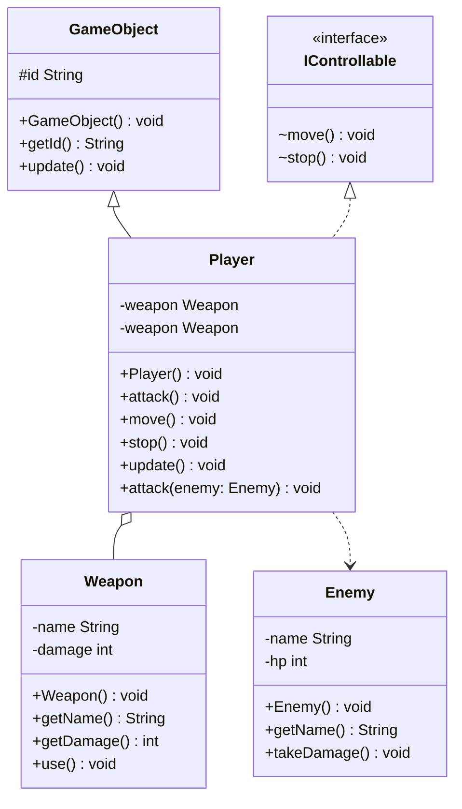

```mermaid
classDiagram
    class Enemy {
    -name String
    -hp int
    +Enemy() void
    +getName() String
    +takeDamage() void
    }
    class GameObject {
    #id String
    +GameObject() void
    +getId() String
    +update() void
    }
    class IControllable {
    <<interface>>
    ~move() void
    ~stop() void
    }
    class Player {
    -weapon Weapon
    +Player() void
    +attack() void
    +move() void
    +stop() void
    +update() void
    }
    class Weapon {
    -name String
    -damage int
    +Weapon() void
    +getName() String
    +getDamage() int
    +use() void
    }

    %% === 관계 ===
    class Player {
    -weapon Weapon
    +attack(enemy: Enemy) void
    }
    class Weapon {
    }
    class Enemy {
    }
    class GameObject {
    }
    class IControllable {
    <<interface>>
    }
    GameObject <|-- Player
    IControllable <|.. Player
    Player o-- Weapon
    Player ..> Enemy
```