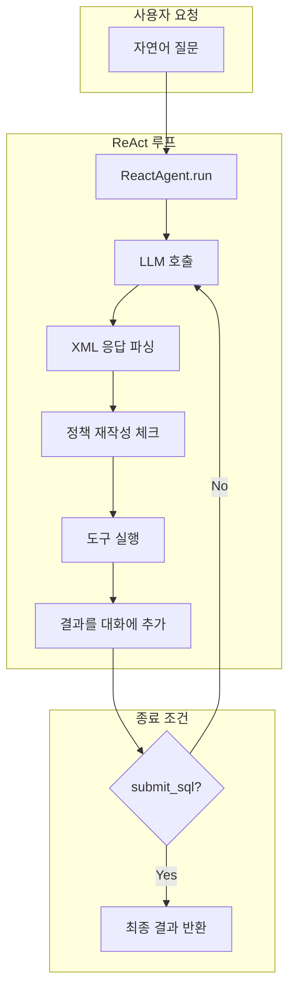
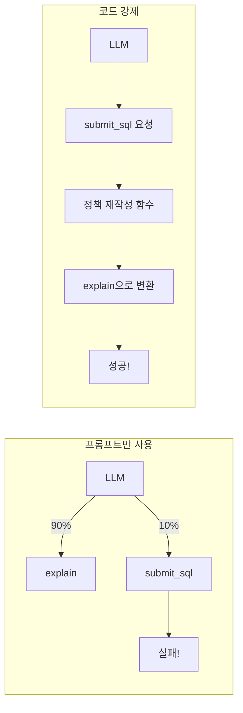
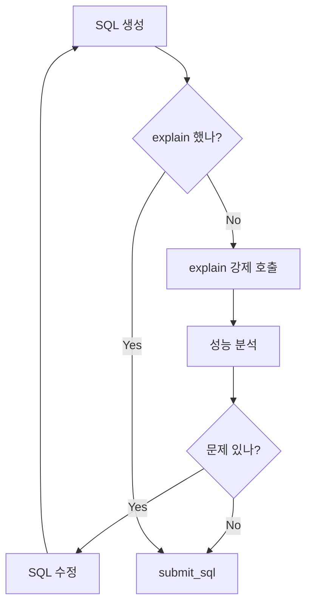

# neo4j-text2sql ReAct 프레임워크 초상세 아키텍처 문서

> 이 문서는 neo4j-text2sql 프로젝트의 ReAct 프레임워크 구현을 완전히 분석합니다.  
> 새로운 ReAct 프레임워크를 구축할 때 참고할 수 있도록 모든 설계 결정, 코드 구조, 특별 전략을 상세히 기술합니다.

---

## 목차

- [Part 1: 전체 아키텍처](#part-1-전체-아키텍처)
  - [1. 시스템 개요](#1-시스템-개요)
  - [2. 핵심 파일 구조](#2-핵심-파일-구조)
- [Part 2: 다중 도구 호출 메커니즘](#part-2-다중-도구-호출-메커니즘-핵심)
  - [3. 왜 다중 호출이 필요한가](#3-왜-다중-호출이-필요한가)
  - [4. 다중 도구 호출 실패 원인과 해결책](#4-다중-도구-호출-실패-원인과-해결책-핵심)
- [Part 3: 정확도 개선 전략](#part-3-정확도-개선-전략)
  - [5. 스키마 검색 전략](#5-스키마-검색-전략)
  - [6. SQL 검증 전략](#6-sql-검증-전략)
  - [7. 캐싱 전략](#7-캐싱-전략)
  - [8. Value Mapping 전략](#8-value-mapping-전략)
- [Part 4: 스트리밍 처리](#part-4-스트리밍-처리)
  - [9. XML 스트리밍 추출](#9-xml-스트리밍-추출)
- [Part 5: 에러 복구 전략](#part-5-에러-복구-전략)
  - [10. XML 파싱 실패 복구](#10-xml-파싱-실패-복구)
- [Part 6: 구현 체크리스트](#part-6-구현-체크리스트)

---

# Part 1: 전체 아키텍처

## 1. 시스템 개요

### 1.1 ReAct 에이전트 흐름



### 1.2 핵심 개념

| 개념 | 설명 |
|------|------|
| **ReAct 루프** | Reasoning + Acting의 반복. LLM이 생각하고, 도구를 호출하고, 결과를 관찰하는 과정 반복 |
| **정책 재작성** | LLM이 잘못된 도구를 호출해도 코드 레벨에서 강제로 올바른 도구로 변환 |
| **XML 기반 통신** | LLM과의 모든 입출력을 XML 형식으로 구조화 |
| **상태 추적** | 세션 전체에서 어떤 도구를 호출했는지, 몇 번 호출했는지 추적 |

---

## 2. 핵심 파일 구조

### 2.1 파일 역할 매핑

| 파일 | 역할 | 핵심 클래스/함수 |
|------|------|-----------------|
| `app/react/agent.py` | ReAct 에이전트 핵심 루프 | `ReactAgent`, `_maybe_rewrite_tool_call_for_policy()` |
| `app/react/state.py` | 세션 상태 관리 | `ReactSessionState`, `ReactMetadata` |
| `app/react/tools/__init__.py` | 도구 레지스트리 | `TOOL_REGISTRY`, `execute_tool()` |
| `app/react/prompts/react_prompt.xml` | 시스템 프롬프트 | XML 형식의 페르소나, 규칙, 도구 정의 |
| `app/routers/react.py` | FastAPI 라우터 | HTTP 요청 처리, 스트리밍 응답 |
| `app/core/sql_guard.py` | SQL 검증 | `SQLGuard.validate()` |
| `app/react/streaming_xml_sections.py` | 스트리밍 XML 파싱 | `StreamingXmlSectionsExtractor` |

### 2.2 도구(Tool) 파일 구조

```
app/react/tools/
├── __init__.py           # 도구 레지스트리
├── context.py            # ToolContext (공통 의존성)
├── search_tables.py      # 테이블 검색
├── search_columns.py     # 컬럼 검색
├── search_column_values.py  # 컬럼 값 검색
├── explain.py            # SQL 성능 분석
├── execute_sql_preview.py   # SQL 미리보기 실행
├── submit_sql.py         # SQL 최종 제출
├── find_similar_query.py # 유사 쿼리 검색
└── neo4j_utils.py        # Neo4j 유틸리티
```

---

# Part 2: 다중 도구 호출 메커니즘 (핵심!)

## 3. 왜 다중 호출이 필요한가

### 3.1 단일 호출의 한계

```
사용자: "매출이 가장 높은 고객은?"
  ↓
LLM: "SELECT * FROM customers ORDER BY sales DESC LIMIT 1"
  ↓
문제:
  - 테이블명이 맞는지? (customers vs customer)
  - 컬럼명이 맞는지? (sales vs total_sales)
  - 성능은 괜찮은지? (인덱스 사용?)
  - WHERE 조건이 필요한지? (활성 고객만?)
```

**단일 호출의 문제점:**
1. **스키마 불일치**: 테이블/컬럼명이 실제 DB와 다를 수 있음
2. **성능 미검증**: Full Table Scan 등 성능 문제 미탐지
3. **값 불일치**: 자연어 값과 실제 코드값 불일치 (예: "서울" vs "SEL")
4. **결과 미확인**: 실제 결과가 의도와 맞는지 확인 불가

### 3.2 다중 호출로 해결

```
Step 1: search_tables("고객")
        → customers, customer_info, client 테이블 발견
        → customers 선택

Step 2: search_columns("customers", "매출")
        → total_sales, revenue, amount 컬럼 발견
        → total_sales 선택

Step 3: explain("SELECT * FROM customers ORDER BY total_sales DESC LIMIT 1")
        → Index Scan 확인, 성능 OK

Step 4: execute_sql_preview(...)
        → 결과 미리보기: {"name": "홍길동", "total_sales": 1000000}

Step 5: submit_sql(...)
        → 최종 제출
```

**다중 호출의 장점:**
1. **검증된 스키마**: 실제 존재하는 테이블/컬럼 사용
2. **성능 보장**: explain으로 성능 문제 사전 탐지
3. **값 정확성**: search_column_values로 실제 값 확인
4. **결과 확인**: execute_sql_preview로 의도 확인

---

## 4. 다중 도구 호출 실패 원인과 해결책 (핵심!)

### 4.1 LLM의 확률적 특성과 코드 레벨 강제의 필요성

#### 문제: 프롬프트만으로는 100% 보장 불가

**LLM은 확률적 모델입니다:**

- 같은 프롬프트라도 매번 다른 출력 가능
- "반드시 explain 먼저"라고 해도 → 가끔 submit 바로 호출
- 프롬프트를 아무리 강하게 해도 → 100% 보장 불가

#### 왜 프롬프트만으로는 부족한가?

```xml
<!-- 프롬프트에 이렇게 강하게 써도 -->
<rule id="3" name="Mandatory Explain">
    <critical>You MUST call explain BEFORE submit_sql</critical>
    <warning>If you skip explain, the system will fail</warning>
    <consequence>Your response will be rejected</consequence>
</rule>
```

**실제 LLM 응답:**

```
시나리오 1: LLM이 올바르게 판단 (90%)
  LLM: "먼저 explain으로 성능을 확인해야 합니다"
  → explain 호출 ✅

시나리오 2: LLM이 잘못 판단 (10%)
  LLM: "SQL이 완성되었으니 바로 제출하겠습니다"
  → submit_sql 호출 ❌ (프롬프트 무시!)
```

**결론: 프롬프트는 "가이드라인"일 뿐, "강제"가 아닙니다!**

#### 해결: 코드 레벨에서 강제



#### 비유

| 방법 | 비유 | 보장률 |
|------|------|--------|
| 프롬프트만 | "신호등이 빨간 불이면 멈추세요" (안내문) | ~90% |
| 코드 강제 | "빨간 불이면 자동차가 강제로 멈춤" (시스템) | 100% |

---

### 4.2 실패 사례: REACT-robo-analyzer

#### 문제 코드

```python
# llm_agent.py - run() 메서드 내부
async def run(self, state, tool_context, ...):
    for _ in range(iteration_limit):
        # 1. LLM 호출
        response = await self._call_llm(...)
        
        # 2. 응답 파싱
        parsed_step = self._parse_llm_response(response)
        
        # 3. ❌ 정책 재작성 함수 없음!
        #    바로 도구 실행으로 넘어감
        
        # 4. 도구 실행
        tool_name = parsed_step.tool_call.name  # 그대로 사용!
        tool_result = await execute_tool(tool_name, ...)
        
        # 5. 종료 체크
        if tool_name == "submit_result":  # ❌ 바로 종료!
            return AgentOutcome(status="submit_result")
        
        state.iteration += 1
```

#### 왜 단일 호출만 되는가?

```
사용자 질문: "이 코드 분석해줘"
  ↓
LLM 응답: "submit_result 호출하겠습니다"  # 탐색 없이 바로!
  ↓
코드: if tool_name == "submit_result": return  # 바로 종료!
  ↓
결과: 1회 호출로 끝 (탐색 도구 사용 안 함)
```

**문제점 요약:**
1. LLM이 `submit_result`를 바로 호출하면 → 즉시 종료
2. 프롬프트에 "탐색 먼저"라고 써도 → LLM이 무시할 수 있음
3. 코드에서 강제하는 로직 없음 → 다중 호출 보장 불가

---

### 4.3 성공 사례: neo4j-text2sql (정책 재작성)

#### 핵심 코드: 정책 재작성 함수

```python
# agent.py의 _maybe_rewrite_tool_call_for_policy()
def _maybe_rewrite_tool_call_for_policy(
    *,
    step: ReactStep,
    state: ReactSessionState,
) -> Optional[Dict[str, Any]]:
    """
    Runtime tool_call rewrite policy.
    - If remaining_tool_calls <= 1 and tool is execute_sql_preview -> submit_sql
    - Else if no successful explain yet in session and tool is execute_sql_preview/submit_sql -> explain
    
    Keeps 'has_any_explain' relaxed policy: once at least one explain succeeded, allow mismatches.
    """
    tool_name = step.tool_call.name
    
    # 종료 도구가 아니면 무시 (탐색 도구는 그대로 실행)
    if tool_name not in {"execute_sql_preview", "submit_sql"}:
        return None

    sql_text = (step.tool_call.parsed_parameters or {}).get("sql", "") or ""
    is_last_call = state.remaining_tool_calls <= 1

    # 규칙 1: 마지막 호출이면 강제로 submit_sql
    # (execute_sql_preview를 호출해도 submit_sql로 변환)
    if is_last_call and tool_name == "execute_sql_preview":
        _rewrite_step_tool_call(step=step, to_tool_name="submit_sql", sql_text=sql_text)
        return {
            "from": "execute_sql_preview",
            "to": "submit_sql",
            "reason": "last_call_force_submit",
        }

    # 규칙 2: explain 안 했으면 강제로 explain
    # (submit_sql이나 execute_sql_preview를 호출해도 explain으로 변환)
    if (not is_last_call) and tool_name in {"execute_sql_preview", "submit_sql"}:
        has_any_explain = state.has_any_explained_sql()
        is_explained = state.is_sql_explained(sql_text)
        
        if (not has_any_explain) and (not is_explained):
            _rewrite_step_tool_call(step=step, to_tool_name="explain", sql_text=sql_text)
            return {
                "from": tool_name,
                "to": "explain",
                "reason": "require_explain_first",
            }

    return None
```

#### 핵심 루프에서 사용

```python
# agent.py - run() 메서드 내부
async def run(self, state, tool_context, ...):
    while state.iteration < max_iterations:
        # 1. LLM 호출
        response = await self._call_llm(...)
        
        # 2. 응답 파싱
        parsed_step = self._parse_llm_response(response)
        
        # 3. ⭐ 핵심! 정책 재작성 함수 호출
        rewrite_info = _maybe_rewrite_tool_call_for_policy(
            step=parsed_step,
            state=state
        )
        if rewrite_info:
            # 로깅: "submit_sql → explain으로 변환됨"
            logger.info(f"Tool rewritten: {rewrite_info}")
        
        # 4. 도구 실행 (재작성된 도구 이름 사용!)
        tool_name = parsed_step.tool_call.name  # 재작성됨!
        tool_result = await execute_tool(tool_name, ...)
        
        # 5. 상태 업데이트 (어떤 도구를 실행했는지 기록)
        if tool_name == "explain":
            state.add_explained_sql(sql_text)
        
        # 6. 종료 체크
        if tool_name == "submit_sql":
            return AgentOutcome(status="submit_sql")
        
        state.iteration += 1
```

#### 왜 다중 호출이 되는가?

```
사용자 질문: "매출이 가장 높은 고객은?"
  ↓
Step 1: LLM "submit_sql 호출하겠습니다"
        ↓
        정책 재작성: "explain 안 했으니 explain으로 변환!"
        ↓
        explain 실행 (submit_sql 아님!)
        ↓
        state.add_explained_sql(sql_text)  # 상태 업데이트
  ↓
Step 2: LLM "submit_sql 호출하겠습니다"
        ↓
        정책 재작성: 통과 (explain 완료 상태)
        ↓
        submit_sql 실행
  ↓
결과: 2회 호출 (검증 후 제출)
```

---

### 4.4 두 프로젝트 비교

| 항목 | REACT-robo-analyzer | neo4j-text2sql |
|------|---------------------|----------------|
| 정책 재작성 함수 | ❌ 없음 | ✅ `_maybe_rewrite_tool_call_for_policy()` |
| 다중 호출 보장 | ❌ 프롬프트에 의존 | ✅ 코드로 강제 |
| 상태 추적 | 기본적 (iteration만) | `has_any_explain`, `remaining_tool_calls`, `explained_sqls` |
| 종료 조건 | LLM 선택에 의존 | 코드로 제어 |
| 결과 | 1회 호출로 끝남 | 검증 후 제출 |

---

### 4.5 해결책: 정책 재작성 함수 도입

#### 필요한 코드 추가 (예시)

```python
# policy.py
def _maybe_rewrite_tool_call_for_policy(step, state):
    """
    LLM이 잘못된 도구를 호출해도 강제로 올바른 도구로 변환합니다.
    """
    tool_name = step.tool_call.name
    
    # 종료 도구가 아니면 무시
    if tool_name != "submit_result":
        return None
    
    # 탐색 도구를 한 번도 안 썼으면 강제 변환
    if not state.has_used_exploration_tool():
        _rewrite_step_tool_call(step, to_tool_name="analyze_code")
        return {
            "from": "submit_result",
            "to": "analyze_code",
            "reason": "require_exploration_first"
        }
    
    # 최소 탐색 횟수 미충족이면 강제 변환
    if state.exploration_tool_count < state.min_exploration_required:
        _rewrite_step_tool_call(step, to_tool_name="search_relationships")
        return {
            "from": "submit_result",
            "to": "search_relationships",
            "reason": "need_more_exploration"
        }
    
    return None
```

#### 상태 추적 추가 (예시)

```python
# state.py
@dataclass
class ReactSessionState:
    iteration: int = 0
    exploration_tool_count: int = 0
    min_exploration_required: int = 2
    used_tools: List[str] = field(default_factory=list)
    
    def has_used_exploration_tool(self) -> bool:
        """탐색 도구를 최소 횟수 이상 사용했는지 확인"""
        return self.exploration_tool_count >= self.min_exploration_required
    
    def record_tool_use(self, tool_name: str):
        """도구 사용 기록"""
        self.used_tools.append(tool_name)
        if tool_name in {"analyze_code", "search_relationships", "find_dependencies"}:
            self.exploration_tool_count += 1
```

#### 핵심 루프에 통합 (예시)

```python
# agent.py
async def run(self, state, tool_context, ...):
    while state.iteration < max_iterations:
        # 1. LLM 호출
        response = await self._call_llm(...)
        
        # 2. 응답 파싱
        parsed_step = self._parse_llm_response(response)
        
        # 3. ⭐ 정책 재작성 함수 호출 (핵심!)
        rewrite_info = _maybe_rewrite_tool_call_for_policy(
            step=parsed_step,
            state=state
        )
        if rewrite_info:
            logger.info(f"Tool rewritten: {rewrite_info}")
        
        # 4. 도구 실행 (재작성된 도구 이름 사용)
        tool_name = parsed_step.tool_call.name
        tool_result = await execute_tool(tool_name, ...)
        
        # 5. 상태 업데이트
        state.record_tool_use(tool_name)
        
        # 6. 종료 체크
        if tool_name == "submit_result":
            return AgentOutcome(status="completed")
        
        state.iteration += 1
```

---

# Part 3: 정확도 개선 전략

## 5. 스키마 검색 전략

### 5.1 테이블 중요도 순위 (FK 관계 기반)

**개념:**
- FK(Foreign Key) 관계가 많은 테이블 = 중요한 테이블
- 많은 테이블이 참조하는 테이블 = 핵심 엔티티

**구현:**

```python
# search_tables.py
def _compute_importance_score(table_name: str, neo4j_client) -> float:
    """
    FK 관계 수에 기반한 중요도 점수 계산.
    log1p를 사용하여 극단적인 값 방지.
    """
    # 이 테이블을 참조하는 FK 수 (역방향)
    incoming_fk = get_incoming_fk_count(table_name, neo4j_client)
    # 이 테이블이 참조하는 FK 수 (순방향)
    outgoing_fk = get_outgoing_fk_count(table_name, neo4j_client)
    
    # 역방향 FK가 더 중요 (많이 참조되는 = 핵심 테이블)
    return math.log1p(incoming_fk * 2 + outgoing_fk)

def _rank_tables(tables: list, similarities: list, neo4j_client) -> list:
    """
    유사도 + 중요도의 조화평균으로 테이블 순위 결정.
    조화평균: 둘 다 높아야 높은 점수.
    """
    for table in tables:
        sim = similarities[table.name]
        imp = _compute_importance_score(table.name, neo4j_client)
        # 조화평균: 2 * (a * b) / (a + b)
        table.score = 2 * (sim * imp) / (sim + imp + 1e-9)
    
    return sorted(tables, key=lambda t: t.score, reverse=True)
```

**예시:**

```
질문: "고객 주문 정보"
  ↓
벡터 검색 결과:
  - customers (유사도 0.9, FK 10개) → 점수 높음
  - customer_temp (유사도 0.8, FK 0개) → 점수 낮음
  ↓
조화평균 적용:
  - customers: 2 * (0.9 * 2.4) / (0.9 + 2.4) = 1.31
  - customer_temp: 2 * (0.8 * 0) / (0.8 + 0) = 0
  ↓
결과: customers 선택 (중요한 테이블)
```

### 5.2 프로그레시브 키워드 검색

**개념:**
- 키워드로 검색 → 결과 없으면 → 키워드 축소하며 재시도
- 예: "서울특별시" → "서울특별" → "서울특" → "서울"

**구현:**

```python
# search_column_values.py
async def search_column_values(column_fqn: str, keyword: str, ...):
    """
    프로그레시브 키워드 검색.
    전체 키워드로 검색 후, 결과 없으면 키워드를 점진적으로 축소.
    """
    original_keyword = keyword
    results = []
    
    # 전체 키워드로 검색
    results = await db_search(column_fqn, keyword)
    
    # 결과 없으면 키워드 축소하며 재시도
    while not results and len(keyword) > 2:
        keyword = keyword[:-1]  # 마지막 글자 제거
        results = await db_search(column_fqn, keyword)
    
    # 로깅
    if keyword != original_keyword:
        logger.info(f"Keyword reduced: {original_keyword} → {keyword}")
    
    return results
```

**예시:**

```
질문: "서울특별시에 있는 고객"
  ↓
Step 1: search_column_values("customers.city", "서울특별시")
        → 결과 없음 (DB에는 "서울"만 있음)
  ↓
Step 2: search_column_values("customers.city", "서울특별")
        → 결과 없음
  ↓
Step 3: search_column_values("customers.city", "서울")
        → 결과 있음! ["서울"]
  ↓
결과: WHERE city = '서울'
```

### 5.3 PostgreSQL 에러에서 힌트 컬럼 추출

**개념:**
- SQL 실행 오류 메시지에서 관련 컬럼 정보 추출
- 예: "column region does not exist" → region 컬럼 검색 제안

**구현:**

```python
# search_column_values.py
def _extract_hint_columns_from_error(error_message: str) -> List[str]:
    """
    PostgreSQL 에러 메시지에서 힌트 컬럼 추출.
    """
    hints = []
    
    # 패턴 1: column "xxx" does not exist
    pattern1 = r'column "(\w+)" does not exist'
    match = re.search(pattern1, error_message)
    if match:
        hints.append(match.group(1))
    
    # 패턴 2: Perhaps you meant to reference the column "table"."column"
    pattern2 = r'Perhaps you meant to reference the column "(\w+)"."(\w+)"'
    match = re.search(pattern2, error_message)
    if match:
        hints.append(f"{match.group(1)}.{match.group(2)}")
    
    return hints
```

---

## 6. SQL 검증 전략

### 6.1 Mandatory Explain 정책

**개념:**
- SQL 제출 전 반드시 `explain` 호출 필수
- 성능 문제(Full Table Scan 등) 사전 탐지



**구현 (정책 재작성):**

```python
# agent.py
def _maybe_rewrite_tool_call_for_policy(step, state):
    tool_name = step.tool_call.name
    
    # explain 안 했으면 강제로 explain
    if tool_name in {"execute_sql_preview", "submit_sql"}:
        if not state.has_any_explained_sql():
            _rewrite_step_tool_call(step, to_tool_name="explain")
            return {"reason": "require_explain_first"}
    
    return None
```

### 6.2 SQL Guard

**개념:**
- SQL 실행 전 보안/안전 검증
- DML/DDL 차단, 위험 패턴 감지, 자동 LIMIT 추가

**구현:**

```python
# sql_guard.py
class SQLGuard:
    """SQL 보안 및 안전 검증"""
    
    def validate(self, sql: str) -> ValidationResult:
        errors = []
        warnings = []
        
        # 1. DML/DDL 차단
        if self._is_dml_or_ddl(sql):
            errors.append("DML/DDL statements are not allowed")
        
        # 2. 위험 패턴 감지
        dangerous_patterns = [
            r"DROP\s+TABLE",
            r"TRUNCATE\s+TABLE",
            r"DELETE\s+FROM.*WHERE\s+1\s*=\s*1",
            r"--.*$",  # SQL 주석 (인젝션 시도)
        ]
        for pattern in dangerous_patterns:
            if re.search(pattern, sql, re.IGNORECASE):
                errors.append(f"Dangerous pattern detected: {pattern}")
        
        # 3. JOIN/서브쿼리 깊이 제한
        join_count = sql.upper().count("JOIN")
        if join_count > 3:
            warnings.append(f"Too many JOINs ({join_count}). Consider simplifying.")
        
        subquery_depth = self._count_subquery_depth(sql)
        if subquery_depth > 2:
            warnings.append(f"Subquery depth too deep ({subquery_depth})")
        
        # 4. 자동 LIMIT 추가
        if "LIMIT" not in sql.upper() and "SELECT" in sql.upper():
            sql = self._add_limit(sql, default_limit=100)
        
        return ValidationResult(
            sql=sql,
            errors=errors,
            warnings=warnings,
            is_valid=len(errors) == 0
        )
    
    def _is_dml_or_ddl(self, sql: str) -> bool:
        """DML/DDL 문인지 확인"""
        dml_ddl_keywords = ["INSERT", "UPDATE", "DELETE", "CREATE", "DROP", "ALTER", "TRUNCATE"]
        sql_upper = sql.upper().strip()
        return any(sql_upper.startswith(kw) for kw in dml_ddl_keywords)
    
    def _add_limit(self, sql: str, default_limit: int = 100) -> str:
        """LIMIT 절 추가"""
        sql = sql.rstrip(";").strip()
        return f"{sql} LIMIT {default_limit}"
```

### 6.3 Explain 분석 생성기

**개념:**
- EXPLAIN 결과를 분석하여 성능 문제 탐지
- Full Table Scan, Missing Index 등 경고 생성

**구현:**

```python
# explain_analysis_generator.py
class ExplainAnalysisGenerator:
    """SQL EXPLAIN 결과 분석"""
    
    def analyze(self, explain_result: List[Dict]) -> AnalysisResult:
        risks = []
        suggestions = []
        
        for node in explain_result:
            node_type = node.get("Node Type", "")
            
            # Full Table Scan 감지
            if node_type == "Seq Scan":
                rows = node.get("Plan Rows", 0)
                if rows > 10000:
                    risks.append(f"Full Table Scan on {rows} rows")
                    suggestions.append("Consider adding an index")
            
            # Nested Loop 경고
            if node_type == "Nested Loop":
                inner_rows = node.get("Plan Rows", 0)
                if inner_rows > 1000:
                    risks.append("Expensive Nested Loop")
                    suggestions.append("Consider using JOIN hints")
            
            # Sort 메모리 사용량
            if node_type == "Sort":
                sort_method = node.get("Sort Method", "")
                if "external" in sort_method.lower():
                    risks.append("External disk sort (memory exceeded)")
                    suggestions.append("Increase work_mem or reduce result set")
        
        return AnalysisResult(
            risks=risks,
            suggestions=suggestions,
            is_efficient=len(risks) == 0
        )
```

---

## 7. 캐싱 전략

### 7.1 쿼리 캐시 (In-Memory LRU)

**개념:**
- 동일/유사 질문에 대한 결과 캐싱
- TTL 기반 만료, LRU 기반 용량 관리

**구현:**

```python
# query_cache.py
from functools import lru_cache
from dataclasses import dataclass
from datetime import datetime, timedelta

@dataclass
class CacheEntry:
    result: Any
    created_at: datetime
    
    def is_expired(self, ttl: int) -> bool:
        return datetime.now() - self.created_at > timedelta(seconds=ttl)

class QueryCache:
    """In-Memory LRU 쿼리 캐시"""
    
    def __init__(self, max_size: int = 1000, ttl: int = 3600):
        self.cache: Dict[str, CacheEntry] = {}
        self.max_size = max_size
        self.ttl = ttl
        self.access_order: List[str] = []
    
    def _hash(self, query: str) -> str:
        """질문을 해시화"""
        return hashlib.md5(query.encode()).hexdigest()
    
    def get(self, query: str) -> Optional[Any]:
        """캐시에서 결과 조회"""
        key = self._hash(query)
        entry = self.cache.get(key)
        
        if entry is None:
            return None
        
        if entry.is_expired(self.ttl):
            del self.cache[key]
            return None
        
        # LRU: 접근 순서 갱신
        self._update_access(key)
        return entry.result
    
    def set(self, query: str, result: Any):
        """캐시에 결과 저장"""
        key = self._hash(query)
        
        # 용량 초과 시 가장 오래된 항목 제거
        if len(self.cache) >= self.max_size:
            self._evict_oldest()
        
        self.cache[key] = CacheEntry(result=result, created_at=datetime.now())
        self._update_access(key)
    
    def _update_access(self, key: str):
        """접근 순서 갱신"""
        if key in self.access_order:
            self.access_order.remove(key)
        self.access_order.append(key)
    
    def _evict_oldest(self):
        """가장 오래된 항목 제거"""
        if self.access_order:
            oldest = self.access_order.pop(0)
            self.cache.pop(oldest, None)
```

### 7.2 유사 쿼리 검색 (Embedding 기반)

**개념:**
- 과거 성공한 쿼리를 벡터화하여 저장
- 새 질문과 유사한 과거 쿼리 검색
- 템플릿 재사용 또는 적용

**구현:**

```python
# find_similar_query.py
async def find_similar_query(question: str, ...) -> SimilarQueryResult:
    """
    과거 성공한 쿼리 중 유사한 것 검색.
    """
    # 1. 질문 임베딩 생성
    embedding = await embed_text(question)
    
    # 2. 벡터 검색 (Neo4j 또는 별도 벡터 DB)
    similar = await vector_search(
        index_name="query_embeddings",
        query_vector=embedding,
        top_k=5
    )
    
    # 3. 품질 점수로 재순위화
    for query in similar:
        query.final_score = (
            query.similarity * 0.5 +      # 의미적 유사도
            query.success_rate * 0.3 +    # 성공률
            query.usage_count * 0.2       # 사용 빈도
        )
    
    similar = sorted(similar, key=lambda q: q.final_score, reverse=True)
    
    # 4. 액션 결정
    if similar and similar[0].final_score > 0.9:
        # 매우 유사 → 템플릿 즉시 재사용
        return SimilarQueryResult(
            action="IMMEDIATE_TEMPLATE_REUSE",
            template=similar[0].sql_template,
            value_mappings=similar[0].value_mappings
        )
    elif similar and similar[0].final_score > 0.7:
        # 유사 → 템플릿 적용 (일부 수정 필요)
        return SimilarQueryResult(
            action="ADAPT_TEMPLATE",
            template=similar[0].sql_template,
            suggestions=["Check column names", "Verify value mappings"]
        )
    else:
        # 유사하지 않음 → 새로 생성
        return SimilarQueryResult(action="GENERATE_NEW")
```

### 7.3 Gemini 컨텍스트 캐싱

**개념:**
- Gemini API의 시스템 프롬프트 캐싱
- 긴 시스템 프롬프트를 한 번만 전송하고 캐시 사용

**구현:**

```python
# gemini_context_cache.py
class GeminiContextCache:
    """Gemini 시스템 프롬프트 캐싱"""
    
    def __init__(self, ttl: int = 3600, refresh_buffer: int = 300):
        self.cache_id: Optional[str] = None
        self.expires_at: Optional[datetime] = None
        self.ttl = ttl
        self.refresh_buffer = refresh_buffer
    
    async def get_or_create(self, system_prompt: str) -> str:
        """캐시 ID 조회 또는 생성"""
        # 캐시가 유효하면 재사용
        if self._is_valid():
            return self.cache_id
        
        # 새 캐시 생성
        response = await gemini_client.create_context_cache(
            content=system_prompt,
            ttl=self.ttl
        )
        
        self.cache_id = response.cache_id
        self.expires_at = datetime.now() + timedelta(seconds=self.ttl)
        
        return self.cache_id
    
    def _is_valid(self) -> bool:
        """캐시가 유효한지 확인 (버퍼 포함)"""
        if self.cache_id is None or self.expires_at is None:
            return False
        
        # 만료 전 버퍼 시간 고려
        buffer_time = timedelta(seconds=self.refresh_buffer)
        return datetime.now() + buffer_time < self.expires_at
```

---

## 8. Value Mapping 전략

### 8.1 자연어 → 코드값 변환

**개념:**
- 사용자의 자연어 값을 DB의 실제 코드값으로 변환
- 예: "서울" → "SEL", "활성" → "A"

**구현:**

```python
# value_mapping.py
class ValueMapper:
    """자연어 → 코드값 변환"""
    
    def __init__(self, db_client, similarity_threshold: float = 0.8):
        self.db = db_client
        self.threshold = similarity_threshold
    
    async def map(self, natural_value: str, column_fqn: str) -> Optional[str]:
        """
        자연어 값을 DB의 실제 코드값으로 변환.
        
        Args:
            natural_value: 사용자가 입력한 자연어 값 (예: "서울")
            column_fqn: 테이블.컬럼 형식 (예: "customers.region_code")
        
        Returns:
            매핑된 코드값 또는 None
        """
        # DB에서 실제 값 목록 조회
        actual_values = await self.db.get_distinct_values(column_fqn, limit=1000)
        
        if not actual_values:
            return None
        
        # 정확한 매칭 시도
        if natural_value in actual_values:
            return natural_value
        
        # 유사도 매칭
        best_match = None
        best_score = 0
        
        for value in actual_values:
            score = self._compute_similarity(natural_value, value)
            if score > best_score:
                best_score = score
                best_match = value
        
        # 임계값 체크
        if best_score >= self.threshold:
            return best_match
        
        return None
    
    def _compute_similarity(self, a: str, b: str) -> float:
        """두 문자열의 유사도 계산 (Levenshtein 기반)"""
        from difflib import SequenceMatcher
        return SequenceMatcher(None, a.lower(), b.lower()).ratio()
```

### 8.2 Strong-Gated DB 검증

**개념:**
- Value Mapping 결과를 DB에서 실제 존재 여부 확인
- LLM이 잘못 매핑한 경우 필터링

**구현:**

```python
# cache_postprocess.py
async def validate_value_mappings(mappings: List[ValueMapping], db_client) -> List[ValueMapping]:
    """
    Value Mapping을 DB에서 실제 존재 여부 확인.
    존재하지 않는 매핑은 제거.
    """
    validated = []
    
    for mapping in mappings:
        # DB에서 실제 존재 여부 확인
        exists = await db_client.check_value_exists(
            table=mapping.table,
            column=mapping.column,
            value=mapping.value
        )
        
        if exists:
            validated.append(mapping)
        else:
            logger.warning(
                f"Value mapping rejected: {mapping.natural_value} → {mapping.value} "
                f"(not found in {mapping.table}.{mapping.column})"
            )
    
    return validated
```

---

# Part 4: 스트리밍 처리

## 9. XML 스트리밍 추출

### 9.1 점진적 XML 파싱

**개념:**
- LLM 응답이 스트리밍으로 오면서 점진적으로 XML 파싱
- 완성된 섹션부터 UI에 표시

**구현:**

```python
# streaming_xml_sections.py
class StreamingXmlSectionsExtractor:
    """스트리밍 XML 섹션 추출기"""
    
    def __init__(self):
        self.buffer = ""
        self.sections: Dict[str, str] = {}
        self.last_emit_time = 0.0
        self.throttle_interval = 0.1  # 100ms
    
    def feed(self, chunk: str) -> Dict[str, str]:
        """
        청크를 받아 완성된 섹션 반환.
        
        Args:
            chunk: LLM에서 받은 텍스트 청크
        
        Returns:
            완성된 섹션들 (섹션명 → 내용)
        """
        self.buffer += chunk
        
        # 완성된 섹션 추출
        for tag in ["reasoning", "observation", "user_facing", "tool_call"]:
            if self._has_complete_section(tag):
                content = self._extract_section(tag)
                self.sections[tag] = content
        
        return self.sections.copy()
    
    def _has_complete_section(self, tag: str) -> bool:
        """섹션이 완성되었는지 확인"""
        return f"<{tag}>" in self.buffer and f"</{tag}>" in self.buffer
    
    def _extract_section(self, tag: str) -> str:
        """섹션 내용 추출"""
        start_tag = f"<{tag}>"
        end_tag = f"</{tag}>"
        
        start = self.buffer.find(start_tag) + len(start_tag)
        end = self.buffer.find(end_tag)
        
        return self.buffer[start:end].strip()
    
    def should_emit(self) -> bool:
        """스로틀링: emit 해도 되는지 확인"""
        now = time.time()
        if now - self.last_emit_time >= self.throttle_interval:
            self.last_emit_time = now
            return True
        return False
```

### 9.2 스트리밍 응답 생성

**개념:**
- FastAPI에서 SSE(Server-Sent Events)로 스트리밍 응답
- 클라이언트에 실시간 진행 상황 전송

**구현:**

```python
# routers/react.py
from fastapi.responses import StreamingResponse

async def stream_react_response(request: ReactRequest):
    """ReAct 에이전트 스트리밍 응답"""
    
    async def event_generator():
        extractor = StreamingXmlSectionsExtractor()
        
        async for chunk in agent.run_stream(request):
            # 청크 처리
            sections = extractor.feed(chunk.text)
            
            # 스로틀링 체크
            if extractor.should_emit():
                # SSE 형식으로 전송
                yield f"data: {json.dumps(sections)}\n\n"
        
        # 최종 결과 전송
        yield f"data: {json.dumps({'status': 'complete'})}\n\n"
    
    return StreamingResponse(
        event_generator(),
        media_type="text/event-stream"
    )
```

---

# Part 5: 에러 복구 전략

## 10. XML 파싱 실패 복구

### 10.1 LLM 재포맷 요청

**개념:**
- LLM 응답이 잘못된 XML 형식이면, LLM에게 재포맷 요청
- 원본 응답과 함께 "이걸 올바른 XML로 변환해줘" 요청

**구현:**

```python
# agent.py
async def _call_llm_xml_reprint(self, malformed_xml: str) -> str:
    """
    잘못된 XML을 LLM에게 재포맷 요청.
    """
    prompt = f"""
The following XML response is malformed and cannot be parsed.
Please reformat it to be valid XML while preserving the content.

Malformed XML:
```
{malformed_xml}
```

Return ONLY the corrected XML, nothing else.
"""
    
    response = await self.llm.generate(
        prompt=prompt,
        max_tokens=4000,
        temperature=0.0  # 결정적 출력
    )
    
    return response.text
```

### 10.2 CDATA 래핑

**개념:**
- XML 특수 문자(`<`, `>`, `&` 등)가 포함된 내용은 CDATA로 래핑
- 파싱 오류 방지

**구현:**

```python
# xml_util.py
def wrap_cdata(content: str) -> str:
    """
    XML 특수 문자가 포함된 내용을 CDATA로 래핑.
    """
    if any(char in content for char in ["<", ">", "&", '"', "'"]):
        # 이미 CDATA가 아니면 래핑
        if not content.strip().startswith("<![CDATA["):
            return f"<![CDATA[{content}]]>"
    return content

def escape_xml(content: str) -> str:
    """
    XML 특수 문자 이스케이프.
    """
    replacements = [
        ("&", "&amp;"),
        ("<", "&lt;"),
        (">", "&gt;"),
        ('"', "&quot;"),
        ("'", "&apos;"),
    ]
    for old, new in replacements:
        content = content.replace(old, new)
    return content
```

### 10.3 파싱 재시도 로직

**개념:**
- XML 파싱 실패 시 여러 복구 전략 순차 시도
- 1) 재포맷 요청 → 2) 부분 파싱 → 3) 기본값 사용

**구현:**

```python
# agent.py
async def _parse_llm_response_with_recovery(self, response: str) -> ReactStep:
    """
    XML 파싱 실패 시 복구 전략 적용.
    """
    # 1차 시도: 정상 파싱
    try:
        return self._parse_llm_response(response)
    except XMLParseError as e:
        logger.warning(f"XML parse failed: {e}")
    
    # 2차 시도: LLM 재포맷
    try:
        reformatted = await self._call_llm_xml_reprint(response)
        return self._parse_llm_response(reformatted)
    except Exception as e:
        logger.warning(f"XML reformat failed: {e}")
    
    # 3차 시도: 부분 파싱 (정규식)
    try:
        return self._partial_parse(response)
    except Exception as e:
        logger.warning(f"Partial parse failed: {e}")
    
    # 최후 수단: 기본 응답
    return ReactStep(
        reasoning="Failed to parse response",
        tool_call=ToolCall(name="error", parameters={"message": str(e)})
    )
```

---

# Part 6: 구현 체크리스트

## 필수 구현 항목

### 핵심 구조

- [ ] **정책 재작성 함수** (`_maybe_rewrite_tool_call_for_policy`)
  - LLM이 잘못된 도구 호출해도 강제 변환
  - 다중 호출 보장의 핵심

- [ ] **상태 추적 클래스** (`ReactSessionState`)
  - `iteration`: 현재 반복 횟수
  - `remaining_tool_calls`: 남은 도구 호출 수
  - `has_any_explained_sql()`: explain 호출 여부
  - `exploration_tool_count`: 탐색 도구 사용 횟수

- [ ] **도구 레지스트리** (`tools/__init__.py`)
  - 도구명 → 실행 함수 매핑
  - `execute_tool(name, params, context)` 함수

- [ ] **XML 기반 통신**
  - 시스템 프롬프트: XML 형식
  - LLM 응답: XML 형식
  - 파싱 및 생성 유틸리티

### 검증 및 안전

- [ ] **SQL Guard**
  - DML/DDL 차단
  - 위험 패턴 감지
  - 자동 LIMIT 추가

- [ ] **스트리밍 XML 추출**
  - 점진적 파싱
  - 스로틀링
  - SSE 응답

### 캐싱

- [ ] **쿼리 캐시**
  - In-Memory LRU
  - TTL 기반 만료

---

## 선택적 구현 항목

### 정확도 개선

- [ ] **유사 쿼리 검색** (Embedding 기반)
  - 과거 성공 쿼리 재사용
  - 템플릿 적용

- [ ] **Value Mapping**
  - 자연어 → 코드값 변환
  - DB 검증

- [ ] **테이블 중요도 순위**
  - FK 관계 기반
  - 조화평균 점수

### 성능 최적화

- [ ] **Gemini 컨텍스트 캐싱**
  - 시스템 프롬프트 캐싱
  - TTL 및 갱신

- [ ] **Step Confirmation Mode**
  - 각 스텝 사용자 확인
  - 인터랙티브 모드

### 에러 복구

- [ ] **XML 파싱 재시도**
  - LLM 재포맷 요청
  - 부분 파싱
  - 기본값 사용

---

## 구현 우선순위

1. **1순위 (필수)**
   - 정책 재작성 함수
   - 상태 추적 클래스
   - 도구 레지스트리
   - XML 기반 통신

2. **2순위 (권장)**
   - SQL Guard
   - 스트리밍 XML 추출
   - 쿼리 캐시

3. **3순위 (선택)**
   - 유사 쿼리 검색
   - Value Mapping
   - Gemini 컨텍스트 캐싱

