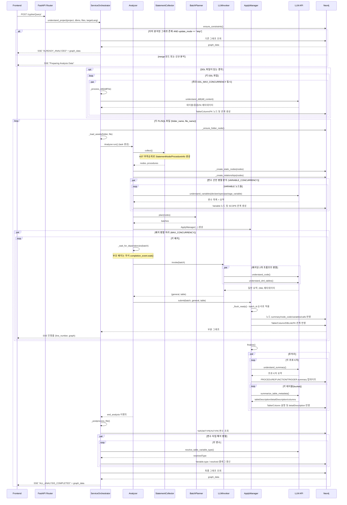

## Understanding 모듈 - 로직 흐름 가이드

> **PL/SQL/PLpgSQL 코드를 Neo4j 그래프로 변환하는 Understanding 파이프라인의 실제 구현 기준 가이드입니다.**
> 
---

## 목차

1. [Understanding 파이프라인 개요](#1-understanding-파이프라인-개요)
2. [데이터 구조](#2-데이터-구조)
3. [단계별 로직 흐름](#3-단계별-로직-흐름)
4. [핵심 클래스 상세](#4-핵심-클래스-상세)
5. [병렬 처리 메커니즘](#5-병렬-처리-메커니즘)
6. [프롬프트 엔지니어링](#6-프롬프트-엔지니어링)
7. [시퀀스 다이어그램](#7-시퀀스-다이어그램)

---

## 1. Understanding 파이프라인 개요

### 1.1 전체 흐름

```text
ANTLR JSON + PL/SQL 파일
        ↓
[Step 0] FastAPI Router - /cypherQuery/ 요청 수신
        ↓
[Step 1] ServiceOrchestrator - 프로젝트/파일 목록·API 키 검증
        ↓
[Step 2] DDL 파일 병렬 처리 (선택)
        ↓
[Step 3] Analyzer 초기화 (파일 단위)
        ↓
[Step 4] StatementCollector - AST 후위순회 수집
        ↓
[Step 5] 정적 그래프 초기화 (노드/관계/변수)
        ↓
[Step 6] BatchPlanner - 토큰 기준 배치 생성
        ↓
[Step 7] LLMInvoker - 배치 단위 LLM 병렬 호출
        ↓
[Step 8] ApplyManager - Neo4j 순차 반영
        ↓
[Step 9] 후처리 (프로시저 요약, 테이블 요약, 변수 타입 해석)
        ↓
Neo4j 그래프 + 요약 메타데이터 완성
```

### 1.2 핵심 설계 원칙

#### 1) 후위순회 (Post-Order Traversal)

Understanding은 AST를 **후위순회**합니다. 이는 자식 노드를 먼저 분석한 후 부모 노드를 분석하여 의존성을 보장하기 위함입니다.

```text
예시: IF 문 구조

IF (condition) THEN
    SELECT ...  ← 자식 1 (먼저 분석)
    INSERT ...  ← 자식 2 (먼저 분석)
END IF;         ← 부모 (마지막 분석, 자식 요약 활용)
```

#### 2) 배치 단위 처리

대규모 코드를 효율적으로 처리하기 위해 **토큰 한도(기본 1000) 기준**으로 배치를 생성합니다.

- **리프 노드**: 토큰 한도 내에서 여러 개를 묶어 배치 생성
- **부모 노드**: 자식 요약 완료 후 **단독 배치**로 처리

#### 3) 병렬 + 순서 보장

- **병렬 처리**: 최대 5개 배치를 동시에 LLM 호출
- **순서 보장**: ApplyManager가 배치 ID 순서대로 Neo4j 반영

---

## 2. 데이터 구조

### 2.1 StatementNode

`StatementNode`는 AST 한 구간(시작/끝 라인, 타입, 코드, 부모·자식 관계 등)을 평탄화해 보관하는 핵심 단위입니다.  
LLM 입력에 사용되는 원본 코드, 자식 요약이 반영된 코드, placeholder 코드 모두 이 객체의 메서드에서 생성됩니다.

```python
@dataclass(slots=True)
class StatementNode:
    node_id: int                      # 고유 ID
    start_line: int                   # 시작 라인
    end_line: int                     # 종료 라인
    node_type: str                    # PROCEDURE, SELECT, IF 등
    code: str                         # 라인 번호 포함 코드
    token: int                        # 토큰 수
    has_children: bool                # 자식 여부
    procedure_key: Optional[str]      # 소속 프로시저 키
    procedure_type: Optional[str]     # PROCEDURE/FUNCTION
    procedure_name: Optional[str]     # 프로시저 이름
    schema_name: Optional[str]        # 스키마 이름
    analyzable: bool                  # LLM 분석 대상 여부
    dml: bool                         # DML 여부
    lines: List[Tuple[int, str]]      # (라인번호, 코드) 리스트
    parent: Optional[StatementNode]   # 부모 노드
    children: List[StatementNode]     # 자식 노드 리스트
    summary: Optional[str]            # LLM 생성 요약
    completion_event: asyncio.Event   # 완료 이벤트
```

#### 주요 메서드

`get_raw_code()`는 라인 번호 포함 원본 코드를 그대로 반환하고, 
`get_compact_code()`는 자식 구간을 자식 요약 텍스트로 치환한 부모용 코드를 만듭니다.  
`get_placeholder_code()`는 자식 구간을 `...code...` placeholder로 유지한 버전으로, 부모 노드의 `summarized_code` 저장 등에 사용됩니다.

```python
def get_raw_code(self) -> str:
    """라인 번호 포함 원문 코드 반환"""
    return '\n'.join(f"{line_no}: {text}" for line_no, text in self.lines)

def get_compact_code(self) -> str:
    """자식 요약을 포함한 부모 코드 반환 (LLM 입력용)"""
    # 자식 구간은 요약으로 대체
    # 부모 고유 코드는 원문 유지
```

**get_compact_code 동작 예시**:

```text
원본 코드:
10: IF v_count > 0 THEN
11:     SELECT * FROM orders;
12:     INSERT INTO logs VALUES (...);
13: END IF;

자식 요약 완료 후 get_compact_code() 결과:
10: IF v_count > 0 THEN
11~12: 주문 정보를 조회하고 로그에 기록합니다
13: END IF;
```

### 2.2 ProcedureInfo

`ProcedureInfo`는 각 프로시저/함수/트리거 루트 노드의 메타데이터와, 남은 분석 노드 개수를 추적하는 구조체입니다.  
`pending_nodes`가 0이 되는 시점에 해당 키에 모아둔 하위 요약들을 이용해, 프로시저 전체 요약 LLM 호출이 비동기 태스크로 실행됩니다.

```python
@dataclass(slots=True)
class ProcedureInfo:
    key: str                    # 고유 키 (folder_file_procedure)
    procedure_type: str         # PROCEDURE/FUNCTION
    procedure_name: str         # 프로시저 이름
    schema_name: Optional[str]  # 스키마
    start_line: int             # 시작 라인
    end_line: int               # 종료 라인
    pending_nodes: int          # 미완료 노드 수 (요약 대기)
```

### 2.3 AnalysisBatch

`AnalysisBatch`는 LLM에 한 번에 보낼 `StatementNode` 리스트와, 각 노드의 (startLine, endLine)을 담은 `ranges`, DML 전용 `dml_ranges`를 함께 보관합니다.  
빌더 메서드는 실제 구현과 동일하게 일반 분석용 payload와 DML 테이블 분석용 payload를 각각 생성합니다.

```python
@dataclass(slots=True)
class AnalysisBatch:
    batch_id: int                       # 배치 ID (순서 보장용)
    nodes: List[StatementNode]          # 배치에 포함된 노드들
    ranges: List[Dict[str, int]]        # 일반 분석용 범위
    dml_ranges: List[Dict[str, int]]    # DML 분석용 범위
    progress_line: int                  # 진행률 표시용 라인
```

#### 주요 메서드

`build_general_payload()`는 각 노드의 `get_compact_code()`를 두 줄 개행으로 연결해, understand_code 프롬프트의 code 입력으로 사용합니다.  
`build_dml_payload()`는 DML 노드를 추려, 부모가 있으면 compact code, 리프면 raw code를 사용해 understand_dml_tables 프롬프트에 전달합니다.

```python
def build_general_payload(self) -> str:
    """일반 LLM 호출용 페이로드 생성"""
    return '\n\n'.join(node.get_compact_code() for node in self.nodes)

def build_dml_payload(self) -> Optional[str]:
    """DML 테이블 분석용 페이로드 생성"""
    dml_nodes = [node for node in self.nodes if node.dml]
    if not dml_nodes:
        return None
    return '\n\n'.join(...)
```

---

## 3. 단계별 로직 흐름

### Step 1: API 요청 처리 (`router.py`)

`/cypherQuery/` 엔드포인트는 헤더에서 사용자/LLM 키/로케일을 추출하고, 바디에서 프로젝트·DBMS·파일 목록·타겟 언어를 읽어 `ServiceOrchestrator`를 생성합니다.  
이후 `orchestrator.understand_project()`가 생성하는 이벤트 스트림을 `stream_with_error_boundary`로 감싸 FastAPI `StreamingResponse`로 그대로 반환합니다.

```python
@router.post("/cypherQuery/")
async def understand_data(request: Request):
    # 1. 헤더에서 user_id, api_key 추출
    user_id = request.headers.get('Session-UUID')
    api_key = request.headers.get('OpenAI-Api-Key')
    
    # 2. 요청 본문 파싱
    file_data = await request.json()
    project_name = file_data['projectName']
    dbms = file_data['dbms']
    
    # 3. ServiceOrchestrator 생성
    orchestrator = ServiceOrchestrator(user_id, api_key, locale, project_name, dbms)
    
    # 4. 스트리밍 응답
    return StreamingResponse(orchestrator.understand_project(file_names))
```

### Step 2: DDL 파일 병렬 처리 (`service.py`)

`ServiceOrchestrator.understand_project()`는 Neo4j 제약을 선행 생성한 뒤, DDL 디렉터리에서 파일 목록을 읽어 최대 `DDL_MAX_CONCURRENCY`(기본 5) 개까지 동시에 처리합니다.  
각 DDL은 `understand_ddl()` 프롬프트로 테이블/컬럼/FK 정보를 뽑은 뒤, Neo4j에 Table/Column/관계 노드를 생성합니다.

```python
async def understand_project(self, file_names):
    # DDL 파일 목록 조회
    ddl_files = self._list_ddl_files()
    
    if ddl_files:
        # 병렬 처리를 위한 세마포어 (최대 5개)
        ddl_semaphore = asyncio.Semaphore(DDL_MAX_CONCURRENCY)
        ddl_tasks = []
        
        async def _run_single_ddl(file_name: str):
            async with ddl_semaphore:
                ddl_content = await self._load_ddl_file(file_name)
                # LLM 호출
                result = await asyncio.to_thread(
                    understand_ddl, ddl_content, self.api_key, self.locale
                )
                # Neo4j 반영
                await self._apply_ddl_result(result, file_name)
        
        # 모든 DDL 파일을 병렬 처리
        for ddl_file in ddl_files:
            ddl_tasks.append(asyncio.create_task(_run_single_ddl(ddl_file)))
        
        await asyncio.gather(*ddl_tasks)
```

**DDL 처리 결과 (실제 Neo4j 구조)**:
- **Table 노드**: `user_id, schema, name, db, project_name, description, table_type, detailDescription`
- **Column 노드**: `name, dtype, nullable, description, fqn, project_name, pk_constraint`
- **HAS_COLUMN / FK_TO_TABLE / FK_TO 관계**: 컬럼/테이블 간 외래키 구조를 그래프에 반영

### Step 3: Analyzer 초기화 (`service.py → understand/analysis.py`)

서비스 레이어는 파일별로 ANTLR JSON과 PL/SQL 텍스트를 비동기로 읽은 뒤, 각 파일마다 `Analyzer` 인스턴스를 하나씩 생성합니다.  
Analyzer는 두 개의 큐를 통해 Neo4j 연결 객체와 통신하며, 분석 진행에 따라 Cypher 쿼리와 라인 번호 이벤트를 주고받습니다.

```python
analyzer = Analyzer(
    antlr_data=antlr_data,           # ANTLR JSON
    file_content=plsql_raw,          # PL/SQL 원본
    send_queue=events_from_analyzer, # 진행 상황 전송 큐
    receive_queue=events_to_analyzer,# 명령 수신 큐
    last_line=last_line,             # 파일 총 라인 수
    folder_name=folder_name,         # 폴더명
    file_name=file_name,             # 파일명
    user_id=self.user_id,
    api_key=self.api_key,
    locale=self.locale,
    dbms=self.dbms,
    project_name=self.project_name,
)

# 비동기 실행
analysis_task = asyncio.create_task(analyzer.run())
```

### Step 4: StatementCollector - AST 후위순회 (`analysis.py`)

`StatementCollector`는 ANTLR JSON의 루트에서 시작해 자식 노드를 먼저 방문하고, 그 결과를 기반으로 부모 `StatementNode`를 생성합니다.  
이 과정에서 코드 라인 단위 스냅샷, 토큰 수, DML 여부, 프로시저 키/이름 등을 함께 계산해 이후 배치·LLM·요약 과정의 기초 데이터를 준비합니다.

#### 알고리즘 (개념 코드)

```python
class StatementCollector:
    def collect(self) -> Tuple[List[StatementNode], Dict[str, ProcedureInfo]]:
        """AST 후위순회로 StatementNode 리스트 생성"""
        self.nodes = []
        self.procedures = {}
        self.node_id_counter = 1
        
        # 루트부터 재귀 방문
        self._visit(
            node=self.antlr_data,
            current_proc=None,
            current_type=None,
            current_schema=None
        )
        
        return self.nodes, self.procedures
    
    def _visit(self, node, current_proc, current_type, current_schema):
        """재귀적으로 노드를 방문 (후위순회)"""
        
        # 1. 자식 먼저 방문 (후위순회)
        child_nodes = []
        for child in node.get('children', []):
            child_node = self._visit(
                child,
                current_proc,
                current_type,
                current_schema
            )
            if child_node:
                child_nodes.append(child_node)
        
        # 2. PROCEDURE 노드 발견 시 ProcedureInfo 생성
        node_type = node['type']
        if node_type in PROCEDURE_TYPES:
            current_proc = self._create_procedure_info(node)
            self.procedures[current_proc.key] = current_proc
        
        # 3. 현재 노드의 StatementNode 생성
        statement_node = self._create_statement_node(
            node, child_nodes, current_proc, node_type, current_schema
        )
        
        # 4. 부모-자식 관계 설정
        for child_node in child_nodes:
            child_node.parent = statement_node
        statement_node.children = child_nodes
        
        # 5. 노드 리스트에 추가 (후위순회이므로 자식이 먼저 추가됨)
        self.nodes.append(statement_node)
        
        return statement_node
```

**후위순회의 장점**:
- 자식 `StatementNode`가 항상 부모보다 먼저 `nodes` 리스트에 추가됩니다.
- 부모 배치 실행 전 `_wait_for_dependencies()`에서 자식 `completion_event`를 모두 기다릴 수 있습니다.
- 프로시저 요약 누적·요약 시점 판단에 필요한 `pending_nodes` 관리가 자연스럽게 가능합니다.

#### 노드 타입 분류 및 코드 스냅샷

```python
def _create_statement_node(self, node, child_nodes, current_proc, node_type, current_schema):
    # analyzable: LLM 분석 대상인가?
    analyzable = node_type not in NON_ANALYSIS_TYPES
    
    # dml: DML 노드인가?
    dml = node_type in DML_STATEMENT_TYPES
    
    # has_children: 자식이 있는가?
    has_children = len(child_nodes) > 0
    
    # 코드 추출
    lines = self._extract_lines(node['startLine'], node['endLine'])
    code = '\n'.join(f"{line_no}: {text}" for line_no, text in lines)
    
    # 토큰 수 계산
    token = calculate_code_token(code)
    
    return StatementNode(
        node_id=self.node_id_counter,
        start_line=node['startLine'],
        end_line=node['endLine'],
        node_type=node_type,
        code=code,
        token=token,
        has_children=has_children,
        procedure_key=current_proc.key if current_proc else None,
        procedure_type=current_proc.procedure_type if current_proc else None,
        procedure_name=current_proc.procedure_name if current_proc else None,
        schema_name=current_schema,
        analyzable=analyzable,
        dml=dml,
        lines=lines,
    )
```

### Step 5: 정적 그래프 초기화 (`Analyzer._initialize_static_graph`)

AST 수집이 끝나면 Analyzer는 먼저 Neo4j에 정적 구조(각 Statement 노드와 PARENT_OF/NEXT 관계, Variable 선언)를 만들어 둡니다.  
이 단계는 LLM 호출과 무관하게 항상 동일한 Cypher 쿼리만 생성되며, 이후 Apply 단계에서는 요약/테이블 메타 정보만 추가로 덧씌웁니다.

```python
async def _initialize_static_graph(self, nodes: List[StatementNode]):
    """정적 그래프 초기화 (3단계)"""
    
    # 1) 노드 본문 생성
    await self._create_static_nodes(nodes)
    
    # 2) 관계 생성 (PARENT_OF, NEXT)
    await self._create_relationships(nodes)
    
    # 3) 변수 선언 병렬 분석
    await self._process_variable_nodes(nodes)
```

#### 5-1. 노드 생성 (`_create_static_nodes`)

```python
async def _create_static_nodes(self, nodes: List[StatementNode]):
    """Neo4j에 기본 노드 생성 (배치 단위)"""
    queries = []
    
    for node in nodes:
        # 노드 속성
        props = {
            'user_id': self.user_id,
            'folder_name': self.folder_name,
            'file_name': self.file_name,
            'startLine': node.start_line,
            'endLine': node.end_line,
            'node_type': node.node_type,
        }
        
        if node.procedure_name:
            props['procedure_name'] = node.procedure_name
        
        # MERGE 쿼리 생성
        query = f"""
        MERGE (n:{node.node_type} {{
            user_id: '{self.user_id}',
            folder_name: '{self.folder_name}',
            file_name: '{self.file_name}',
            startLine: {node.start_line}
        }})
        SET n += {json.dumps(props)}
        """
        queries.append(query)
        
        # 배치 크기에 도달하면 실행
        if len(queries) >= STATIC_QUERY_BATCH_SIZE:
            await self._send_static_queries(queries, node.end_line)
            queries = []
    
    # 남은 쿼리 실행
    if queries:
        await self._send_static_queries(queries, nodes[-1].end_line)
```

#### 5-2. 관계 생성 (`_create_relationships`)

```python
async def _create_relationships(self, nodes: List[StatementNode]):
    """PARENT_OF, NEXT 관계 생성"""
    queries = []
    
    for node in nodes:
        # PARENT_OF 관계
        if node.parent:
            queries.append(f"""
            MATCH (parent:{node.parent.node_type} {{
                user_id: '{self.user_id}',
                folder_name: '{self.folder_name}',
                file_name: '{self.file_name}',
                startLine: {node.parent.start_line}
            }})
            MATCH (child:{node.node_type} {{
                user_id: '{self.user_id}',
                folder_name: '{self.folder_name}',
                file_name: '{self.file_name}',
                startLine: {node.start_line}
            }})
            MERGE (parent)-[:PARENT_OF]->(child)
            """)
    
    # NEXT 관계 (형제 노드 간)
    for i, node in enumerate(nodes):
        if node.parent and i + 1 < len(nodes):
            next_node = nodes[i + 1]
            if next_node.parent == node.parent:
                queries.append(f"""
                MATCH (curr:{node.node_type} {{...}})
                MATCH (next:{next_node.node_type} {{...}})
                MERGE (curr)-[:NEXT]->(next)
                """)
    
    # 배치 실행
    await self._send_static_queries_in_batches(queries)
```

#### 5-3. 변수 선언 병렬 분석 (`_process_variable_nodes`)

```python
async def _process_variable_nodes(self, nodes: List[StatementNode]):
    """DECLARE, SPEC 노드를 병렬 분석"""
    
    # 변수 선언 노드만 필터링
    targets = [node for node in nodes if node.node_type in VARIABLE_DECLARATION_TYPES]
    
    # 세마포어 생성 (최대 5개 동시)
    semaphore = asyncio.Semaphore(VARIABLE_CONCURRENCY)
    
    async def worker(node: StatementNode):
        async with semaphore:
            # LLM 호출 (동기 함수를 스레드에서 실행)
            result = await asyncio.to_thread(
                understand_variables,
                node.get_raw_code(),
                self.api_key,
                self.locale,
            )
            
            # Variable 노드 및 SCOPE 관계 생성
            queries = self._build_variable_queries(node, result)
            await self._send_static_queries(queries, node.end_line)
    
    # 모든 변수 노드를 병렬 처리
    await asyncio.gather(*(worker(node) for node in targets))
```

**understand_variables 프롬프트 결과 예시**:
```json
{
  "variables": [
    {"name": "v_count", "type": "INTEGER", "value": "0", "parameter_type": "LOCAL"},
    {"name": "p_customer_id", "type": "INTEGER", "value": null, "parameter_type": "IN"}
  ],
  "summary": "고객 ID를 입력받아 주문 개수를 세기 위한 변수 선언"
}
```

### Step 6: BatchPlanner - 토큰 기준 배치 생성 (`analysis.py`)

`BatchPlanner`는 `NON_ANALYSIS_TYPES`를 제외한 노드만 대상으로 삼아, 토큰 한도 내에서 리프/부모 배치를 나눕니다.  
부모 노드는 항상 단독 배치이며, 리프 노드는 누적 토큰이 한도를 넘기기 전에 가능한 많이 묶어서 배치로 생성합니다.

```python
class BatchPlanner:
    def __init__(self, token_limit: int = MAX_BATCH_TOKEN):
        self.token_limit = token_limit
    
    def plan(self, nodes: List[StatementNode], folder_file: str) -> List[AnalysisBatch]:
        """토큰 한도 기준 배치 생성"""
        batches: List[AnalysisBatch] = []
        current_nodes: List[StatementNode] = []
        current_tokens = 0
        batch_id = 1
        
        for node in nodes:
            # 분석 불필요 노드는 건너뛰기
            if not node.analyzable:
                continue
            
            # 부모 노드는 단독 배치로 처리
            if node.has_children:
                # 현재 배치가 있으면 먼저 확정
                if current_nodes:
                    batches.append(self._create_batch(batch_id, current_nodes, folder_file))
                    batch_id += 1
                    current_nodes = []
                    current_tokens = 0
                
                # 부모 노드 단독 배치
                batches.append(self._create_batch(batch_id, [node], folder_file))
                batch_id += 1
                continue
            
            # 토큰 한도 초과 시 배치 확정
            if current_nodes and current_tokens + node.token > self.token_limit:
                batches.append(self._create_batch(batch_id, current_nodes, folder_file))
                batch_id += 1
                current_nodes = []
                current_tokens = 0
            
            # 현재 배치에 노드 추가
            current_nodes.append(node)
            current_tokens += node.token
        
        # 마지막 배치
        if current_nodes:
            batches.append(self._create_batch(batch_id, current_nodes, folder_file))
        
        return batches
    
    def _create_batch(self, batch_id: int, nodes: List[StatementNode], folder_file: str) -> AnalysisBatch:
        """AnalysisBatch 객체 생성"""
        ranges = []
        dml_ranges = []
        
        for node in nodes:
            ranges.append({
                'startLine': node.start_line,
                'endLine': node.end_line
            })
            
            if node.dml:
                dml_ranges.append({
                    'startLine': node.start_line,
                    'endLine': node.end_line
                })
        
        return AnalysisBatch(
            batch_id=batch_id,
            nodes=nodes,
            ranges=ranges,
            dml_ranges=dml_ranges,
            progress_line=nodes[-1].end_line
        )
```

**배치 생성 예시 (개념)**:

```text
노드 목록 (후위순회 순서):
1. SELECT (10-12, 200 tokens) - 리프
2. INSERT (14-15, 150 tokens) - 리프
3. IF (10-16, 400 tokens) - 부모
4. UPDATE (18-19, 300 tokens) - 리프
5. LOOP (18-25, 800 tokens) - 부모
6. PROCEDURE (1-30, 1500 tokens) - 부모

배치 결과:
[Batch 1] nodes=[SELECT, INSERT] (350 tokens) - 리프 묶음
[Batch 2] nodes=[IF] (400 tokens) - 부모 단독
[Batch 3] nodes=[UPDATE] (300 tokens) - 리프 단독
[Batch 4] nodes=[LOOP] (800 tokens) - 부모 단독
[Batch 5] nodes=[PROCEDURE] (1500 tokens) - 부모 단독
```

### Step 7: LLMInvoker - 배치 단위 LLM 병렬 호출 (`analysis.py`)

`LLMInvoker`는 한 배치 내에서 일반 코드 분석(understand_code)과 DML 테이블 분석(understand_dml_tables)을 동시에 호출합니다.  
두 호출 모두 동기 LLM 클라이언트를 `asyncio.to_thread`로 래핑해 비동기 컨텍스트에서 병렬 실행합니다.

```python
class LLMInvoker:
    def __init__(self, api_key: str, locale: str):
        self.api_key = api_key
        self.locale = locale
    
    async def invoke(self, batch: AnalysisBatch) -> Tuple[Optional[Dict], Optional[Dict]]:
        """배치 하나를 LLM으로 분석 (2개 프롬프트 병렬 호출)"""
        
        # 1) 일반 코드 분석 태스크
        general_task = None
        if batch.ranges:
            general_task = asyncio.to_thread(
                understand_code,
                batch.build_general_payload(),
                batch.ranges,
                len(batch.ranges),
                self.api_key,
                self.locale,
            )
        
        # 2) DML 테이블 분석 태스크
        table_task = None
        dml_payload = batch.build_dml_payload()
        if dml_payload and batch.dml_ranges:
            table_task = asyncio.to_thread(
                understand_dml_tables,
                dml_payload,
                batch.dml_ranges,
                self.api_key,
                self.locale,
            )
        
        # 3) 병렬 실행
        if general_task and table_task:
            return await asyncio.gather(general_task, table_task)
        elif general_task:
            return await general_task, None
        elif table_task:
            return None, await table_task
        else:
            return None, None
```

### Step 7-1: 배치 워커 및 세마포어 (`Analyzer.run`)

Analyzer는 전체 배치 리스트를 받아 세마포어로 최대 동시 실행 개수를 제한하고, 부모 배치에 대해서는 자식 이벤트 완료를 먼저 기다립니다.  
각 워커는 LLM 호출 후 바로 `ApplyManager.submit()`을 호출해, 결과가 도착한 순서와 무관하게 batch_id 기준 순차 적용이 가능하도록 넘깁니다.

```python
async def run(self):
    """모든 배치를 병렬 처리"""
    # ... (초기화 생략)
    
    # 세마포어 생성 (최대 5개 배치 동시 실행)
    semaphore = asyncio.Semaphore(min(self.max_workers, len(batches)))
    
    async def worker(batch: AnalysisBatch):
        # 부모 노드는 자식 요약 완료 대기
        await self._wait_for_dependencies(batch)
        
        # 세마포어 획득
        async with semaphore:
            # LLM 호출
            general, table = await invoker.invoke(batch)
        
        # 결과 제출
        await apply_manager.submit(batch, general, table)
    
    # 모든 배치를 병렬 실행
    await asyncio.gather(*(worker(batch) for batch in batches))
```

#### 의존성 대기 로직 (`_wait_for_dependencies`)

```python
async def _wait_for_dependencies(self, batch: AnalysisBatch):
    """부모 노드는 자식 노드 완료 대기"""
    for node in batch.nodes:
        if node.has_children:
            # 모든 자식 노드의 completion_event 대기
            await asyncio.gather(
                *(child.completion_event.wait() for child in node.children)
            )
```

### Step 8: ApplyManager - Neo4j 순차 반영 및 요약 스토어 관리 (`analysis.py`)

`ApplyManager`는 LLM 결과를 받아 `_pending` dict에 쌓아 두고, `_next_batch_id`부터 연속된 배치만 Neo4j에 반영합니다.  
일반 분석 결과는 노드 속성·CALL/Variable 사용·summarized_code에 반영되고, DML 분석 결과는 Table/Column/DBLink/FK 관계 및 테이블 요약 버킷에 누적됩니다.

```python
class ApplyManager:
    def __init__(self, ...):
        self._pending: Dict[int, BatchResult] = {}  # 대기 중인 결과
        self._next_batch_id = 1                     # 다음 처리할 배치 ID
        self._lock = asyncio.Lock()                 # 동기화 락
    
    async def submit(self, batch: AnalysisBatch, general: Optional[Dict], table: Optional[Dict]):
        """LLM 결과 제출 및 순차 반영"""
        async with self._lock:
            # 1) 결과를 대기 큐에 저장
            self._pending[batch.batch_id] = BatchResult(
                batch=batch,
                general_result=general,
                table_result=table
            )
            
            # 2) 순서대로 처리 가능한 배치를 즉시 반영
            await self._flush_ready()
    
    async def _flush_ready(self, force: bool = False):
        """준비된 배치를 순차적으로 Neo4j에 반영"""
        while self._next_batch_id in self._pending:
            # 다음 순번 배치 꺼내기
            result = self._pending.pop(self._next_batch_id)
            
            # Neo4j 반영
            await self._apply_batch(result)
            
            # 다음 배치로 이동
            self._next_batch_id += 1
```

#### 배치 반영 로직 (`_apply_batch`)

```python
async def _apply_batch(self, result: BatchResult):
    """하나의 배치 결과를 Neo4j에 반영"""
    queries = []
    
    # 1) 일반 분석 결과 반영 (노드 속성 업데이트)
    if result.general_result:
        queries.extend(self._build_node_queries(result))
    
    # 2) 테이블 분석 결과 반영 (Table/Column 노드 및 관계 생성)
    if result.table_result:
        queries.extend(self._build_table_queries(result))
    
    # 3) Neo4j 쿼리 실행
    if queries:
        await self._send_queries(queries, result.batch.progress_line)
    
    # 4) 노드 완료 이벤트 설정
    for node in result.batch.nodes:
        node.completion_event.set()
    
    # 5) 프로시저 요약 누적
    self._update_summary_store(result)
```

#### 노드 속성 업데이트 쿼리 생성 (`_build_node_queries`)

```python
def _build_node_queries(self, result: BatchResult) -> List[str]:
    """일반 분석 결과를 노드 속성으로 변환"""
    queries = []
    analysis_list = result.general_result.get('analysis', [])
    
    for i, node in enumerate(result.batch.nodes):
        if i >= len(analysis_list):
            break
        
        analysis = analysis_list[i]
        summary = analysis.get('summary', '')
        calls = analysis.get('calls', [])
        variables = analysis.get('variables', [])
        
        # 노드 속성 업데이트
        query = f"""
        MATCH (n:{node.node_type} {{
            user_id: '{self.user_id}',
            folder_name: '{self.folder_name}',
            file_name: '{self.file_name}',
            startLine: {node.start_line}
        }})
        SET n.summary = {json.dumps(summary)},
            n.calls = {json.dumps(calls)},
            n.variables = {json.dumps(variables)},
            n.node_code = {json.dumps(node.get_placeholder_code())}
        """
        queries.append(query)
        
        # 노드 summary 저장 (부모가 사용)
        node.summary = summary
    
    return queries
```

#### 테이블/컬럼 노드 및 관계 생성 쿼리 (`_build_table_queries`)

```python
def _build_table_queries(self, result: BatchResult) -> List[str]:
    """DML 분석 결과를 Table/Column 노드 및 관계로 변환"""
    queries = []
    tables = result.table_result.get('tables', [])
    
    for table_info in tables:
        schema, table_name, dblink = parse_table_identifier(table_info['table'])
        access_mode = table_info['accessMode']  # 'r' (FROM) or 'w' (WRITES)
        
        # 1) Table 노드 MERGE
        queries.append(f"""
        MERGE (t:Table {{
            user_id: '{self.user_id}',
            schema: '{schema}',
            name: '{table_name}',
            db: '{self.dbms}'
        }})
        """)
        
        # 2) DML 노드와 Table 관계 생성
        relationship = TABLE_RELATIONSHIP_MAP[access_mode]  # FROM 또는 WRITES
        queries.append(f"""
        MATCH (dml:{node.node_type} {{...}})
        MATCH (t:Table {{...}})
        MERGE (dml)-[:{relationship}]->(t)
        """)
        
        # 3) Column 노드 MERGE 및 HAS_COLUMN 관계
        for column in table_info.get('columns', []):
            fqn = f"{schema}.{table_name}.{column['name']}"
            queries.append(f"""
            MERGE (c:Column {{
                user_id: '{self.user_id}',
                fqn: '{fqn}'
            }})
            SET c.name = '{column['name']}',
                c.dtype = '{column['dtype']}',
                c.nullable = '{column.get('nullable', 'unknown')}',
                c.description = {json.dumps(column.get('description', ''))}
            WITH c
            MATCH (t:Table {{...}})
            MERGE (t)-[:HAS_COLUMN]->(c)
            """)
    
    return queries
```

### Step 9: 후처리 - 프로시저/테이블/변수 타입 요약

모든 배치 처리가 완료되면 `ApplyManager.finalize()`와 `ServiceOrchestrator._postprocess_file()`이 차례로 실행되며, 프로시저 전체 요약·테이블/컬럼 설명 요약·테이블 타입 변수 해석을 수행합니다.  
이 후처리는 모두 LLM 프롬프트를 별도로 호출하며, 이미 Neo4j에 만들어진 Table/Column/Variable 노드 메타데이터를 활용합니다.

#### 9-1. 프로시저 요약

각 프로시저의 하위 노드 요약을 `_summary_store`에 누적해 두었다가, `pending_nodes`가 0이 되는 시점에 한 번에 LLM으로 보내 전체 동작을 요약합니다.  
요약 결과는 해당 PROCEDURE/FUNCTION/TRIGGER 노드의 `summary` 속성으로 저장됩니다.

```python
async def _finalize_procedure_summary(self, info: ProcedureInfo):
    """프로시저 전체 요약 생성"""
    # 누적된 하위 요약 가져오기
    summaries = self._summary_store.pop(info.key, {})
    if not summaries:
        return
    
    # LLM 호출
    summary_result = await asyncio.to_thread(
        understand_summary,
        summaries,
        self.api_key,
        self.locale
    )
    
    # Neo4j 반영
    query = f"""
    MATCH (n:{info.procedure_type} {{
        procedure_name: '{info.procedure_name}',
        user_id: '{self.user_id}',
        folder_name: '{self.folder_name}',
        file_name: '{self.file_name}'
    }})
    SET n.summary = {json.dumps(summary_result.get('summary', ''))}
    """
    await self._send_queries([query], info.end_line)
```

**understand_summary 입력 예시**:
```json
{
  "SELECT_10_12": "주문 정보를 조회합니다",
  "IF_14_18": "주문 상태가 '완료'이면 포인트를 적립합니다",
  "INSERT_20_21": "로그 테이블에 기록합니다"
}
```

**understand_summary 출력 예시**:
```json
{
  "summary": "이 프로시저는 주문 정보를 조회한 후, 주문이 완료 상태이면 포인트를 적립하고 로그에 기록합니다."
}
```

#### 9-2. 테이블 설명 요약

DML 분석 중 누적된 테이블/컬럼 설명을 `_table_summary_store` 버킷에 모아, 테이블 단위로 summarize_table_metadata 프롬프트를 호출합니다.  
반환된 `tableDescription`과 컬럼 설명은 Table/Column 노드에, `detailDescription`은 사람이 읽기 좋은 텍스트 형태로 Table.detailDescription에 반영됩니다.

```python
async def _finalize_table_summaries(self):
    """모든 테이블의 최종 설명 요약"""
    tasks = [
        self._summarize_table(table_key, data)
        for table_key, data in list(self._table_summary_store.items())
    ]
    await asyncio.gather(*tasks)

async def _summarize_table(self, table_key: Tuple[str, str], data: Dict[str, Any]):
    """단일 테이블 요약"""
    schema, name = table_key
    summaries = list(data.get('summaries') or [])
    columns_map = data.get('columns') or {}
    
    # LLM 호출
    result = await asyncio.to_thread(
        summarize_table_metadata,
        f"{schema}.{name}",
        summaries,
        {col: data['descriptions'] for col, data in columns_map.items()},
        {col: data['metadata'] for col, data in columns_map.items()},
        self.api_key,
        self.locale,
    )
    
    # Neo4j 반영
    table_desc = result.get('tableDescription', '')
    queries = [f"""
    MATCH (t:Table {{
        user_id: '{self.user_id}',
        schema: '{schema}',
        name: '{name}'
    }})
    SET t.description = '{escape_for_cypher(table_desc)}'
    """]
    
    for col in result.get('columns', []):
        col_name = col['name']
        col_desc = col.get('description', '')
        queries.append(f"""
        MATCH (c:Column {{
            user_id: '{self.user_id}',
            fqn: '{schema}.{name}.{col_name}'
        }})
        SET c.description = '{escape_for_cypher(col_desc)}'
        """)
    
    await self._send_queries(queries, 0)
```

#### 9-3. 변수 타입 해석

`%ROWTYPE`, `%TYPE` 같은 테이블 기반 변수는 Neo4j에서 테이블/컬럼 메타를 다시 조회해, `resolve_table_variable_type()` 프롬프트로 실제 타입 문자열을 얻습니다.  
이 결과는 Variable 노드의 `type`·`resolved` 플래그로 갱신되며, 선언 타입이 불명확하거나 테이블을 찾지 못한 경우에는 원래 타입을 유지합니다.

```python
async def _postprocess_file(self, connection, folder_name, file_name, file_pairs):
    """파일별 후처리 (변수 타입 해석)"""
    
    # 변수 타입 해석 대상 조회
    var_rows = await connection.execute_queries(["""
        MATCH (v:Variable {folder_name: '...', file_name: '...', user_id: '...'})
        WHERE v.type CONTAINS '%ROWTYPE' OR v.type CONTAINS '%TYPE'
        WITH v, split(v.type, '.')[0] AS tableName
        MATCH (t:Table {name: toUpper(tableName)})
        OPTIONAL MATCH (t)-[:HAS_COLUMN]->(c:Column)
        RETURN v.name AS varName, v.type AS declaredType, t.schema, t.name, collect(c) AS columns
    """])
    
    # 병렬로 타입 해석
    type_results = await asyncio.gather(*[
        resolve_table_variable_type(
            row['varName'], row['declaredType'], row['schema'], row['table'],
            row['columns'], self.api_key, self.locale
        )
        for row in var_rows
    ])
    
    # Neo4j에 해석된 타입 반영
    update_queries = [
        f"MATCH (v:Variable {{name: '{row['varName']}', ...}}) "
        f"SET v.type = '{result['resolvedType']}', v.resolved = true"
        for row, result in zip(var_rows, type_results)
    ]
    await connection.execute_queries(update_queries)
```

---

## 4. 핵심 클래스 상세

### 4.1 Analyzer

`Analyzer`는 한 개 PL/SQL 파일에 대한 Understanding 파이프라인 전체를 캡슐화하는 진입점 클래스입니다.  
AST 수집 → 정적 그래프 생성 → 배치 플래닝 → LLM 병렬 호출 → Apply 후처리까지 모든 단계를 하나의 `run()` 코루틴에서 순차적으로 orchestration 합니다.

```python
class Analyzer:
    def __init__(self, antlr_data, file_content, send_queue, receive_queue, ...):
        self.antlr_data = antlr_data
        self.file_content = file_content
        self.send_queue = send_queue
        self.receive_queue = receive_queue
        # ... 기타 속성
    
    async def run(self):
        """Understanding 파이프라인 실행"""
        try:
            # 1. AST 수집
            collector = StatementCollector(...)
            nodes, procedures = collector.collect()
            
            # 2. 정적 그래프 초기화
            await self._initialize_static_graph(nodes)
            
            # 3. 배치 플래닝
            planner = BatchPlanner()
            batches = planner.plan(nodes, ...)
            
            # 4. LLM 병렬 호출 및 Neo4j 반영
            await self._process_batches(batches, procedures)
            
            # 5. 종료 이벤트 전송
            await self.send_queue.put({'type': 'end_analysis'})
            
        except Exception as e:
            await self.send_queue.put({'type': 'error', 'message': str(e)})
```

### 4.2 BatchPlanner

`BatchPlanner`는 토큰 한도·부모/자식 관계를 고려해 `StatementNode` 리스트를 LLM 배치 단위로 쪼개는 순수 로직 클래스입니다.  
리프 노드 묶음과 부모 단독 배치를 명확히 분리해, 자식 요약 후 부모 요약이라는 흐름이 항상 보장되도록 설계되어 있습니다.

### 4.3 LLMInvoker

`LLMInvoker`는 한 배치에 대해 일반 코드 분석과 DML 테이블 분석 프롬프트를 동시에 호출하는 작은 래퍼입니다.  
프롬프트별 입력 payload를 구성하고 LangChain LLM 클라이언트를 호출하는 실제 로직은 각 `prompt/*.py` 모듈에 캡슐화되어 있습니다.

### 4.4 ApplyManager

`ApplyManager`는 배치 결과를 순서 보장 하에 Neo4j에 반영하고, 프로시저/테이블 요약용 버킷을 관리하는 상태 홀더입니다.  
`submit()`에서 결과를 `_pending`에 쌓고 `_flush_ready()`에서 배치 ID 순서대로 `_apply_batch()`를 호출한 뒤, 마지막에 `finalize()`로 후처리를 마무리합니다.

---

## 5. 병렬 처리 메커니즘

### 5.1 병렬 처리 단계

Understanding 파이프라인은 실제 코드 기준으로 다음 포인트에서 비동기 병렬 처리를 사용합니다.

1. **DDL 파일 처리**: `_list_ddl_files()` 결과를 기반으로 최대 `DDL_MAX_CONCURRENCY` 개 파일을 동시에 LLM 호출  
2. **변수 선언 분석**: `VARIABLE_CONCURRENCY` 개의 변수 선언 노드를 동시에 `understand_variables()`로 분석  
3. **LLM 배치 실행**: `MAX_CONCURRENCY` 개의 배치를 동시에 `LLMInvoker.invoke()`로 실행  
4. **배치 내부 2중 프롬프트**: 각 배치마다 `understand_code`와 `understand_dml_tables` 프롬프트를 스레드로 병렬 호출  
5. **테이블 요약**: `_finalize_table_summaries()`에서 테이블별 summarize_table_metadata 프롬프트를 동시에 실행  
6. **변수 타입 해석**: `_postprocess_file()`에서 `%ROWTYPE/%TYPE` 변수별 resolve_table_variable_type 프롬프트를 동시에 실행

### 5.2 세마포어를 통한 동시성 제어

```python
# 최대 5개 배치 동시 실행
semaphore = asyncio.Semaphore(5)

async def worker(batch):
    async with semaphore:
        # 세마포어 획득, 최대 5개만 동시 실행
        result = await process_batch(batch)
    # 세마포어 해제
    return result

# 모든 배치 병렬 실행 (하지만 최대 5개만 동시)
await asyncio.gather(*(worker(batch) for batch in batches))
```

### 5.3 의존성 관리

부모 노드는 LLM에 전달되기 전에 자식 노드들의 요약 완료를 반드시 대기합니다.  
`_wait_for_dependencies()`는 배치에 포함된 모든 노드의 자식 `completion_event`를 모아 `asyncio.gather()`로 기다린 뒤, 그 다음에만 LLM 호출을 진행합니다.

```python
async def _wait_for_dependencies(self, batch):
    """부모 노드는 자식 완료 대기"""
    for node in batch.nodes:
        if node.has_children:
            # 모든 자식의 completion_event.wait()
            await asyncio.gather(
                *(child.completion_event.wait() for child in node.children)
            )
```

---

## 6. 프롬프트 엔지니어링

### 6.1 understand_code (`prompt/understand_prompt.py`)

**목적**: 코드 범위별로 동작 요약, 프로시저/함수 호출, 변수 사용을 추출해 `analysis` 배열로 반환합니다.  
Analyzer는 `AnalysisBatch.build_general_payload()`로 만든 코드와 각 노드 범위 정보를 ranges로 함께 전달합니다.

**입력 예시**:
```json
{
  "code": "10: SELECT * FROM orders\n11: WHERE customer_id = p_cust_id\n12: INTO v_order_date;",
  "ranges": [{"startLine": 10, "endLine": 12}],
  "count": 1,
  "locale": "ko"
}
```

**출력 예시**:
```json
{
  "analysis": [
    {
      "startLine": 10,
      "endLine": 12,
      "summary": "고객 ID로 주문 정보를 조회하여 주문 날짜를 가져옵니다",
      "calls": [],
      "variables": ["p_cust_id", "v_order_date"]
    }
  ]
}
```

### 6.2 understand_dml_tables (`prompt/understand_dml_table_prompt.py`)

**목적**: DML 구문에서 테이블·컬럼·FK·DB 링크 메타데이터를 추출해, 범위별 `ranges` 구조로 반환합니다.  
`AnalysisBatch.build_dml_payload()` 결과와 DML 전용 range 리스트를 입력으로 사용합니다.

**입력 예시**:
```json
{
  "code": "10: INSERT INTO orders (customer_id, status)\n11: VALUES (p_cust_id, 'PENDING');",
  "ranges": [{"startLine": 10, "endLine": 11}],
  "locale": "ko"
}
```

**출력 예시**:
```json
{
  "tables": [
    {
      "startLine": 10,
      "endLine": 11,
      "accessMode": "w",
      "table": "orders",
      "tableDescription": "주문 정보를 추가합니다",
      "columns": [
        {"name": "customer_id", "dtype": "INTEGER", "nullable": false, "description": "고객 ID"},
        {"name": "status", "dtype": "VARCHAR", "nullable": false, "description": "주문 상태"}
      ],
      "fkRelations": [],
      "dbLinks": []
    }
  ]
}
```

### 6.3 understand_variables (`prompt/understand_variables_prompt.py`)

**목적**: 변수 선언 코드에서 변수 목록·타입·값·parameter_type을 추출하고, 선언부 요약을 함께 반환합니다.  
Analyzer는 `StatementNode.get_raw_code()`를 그대로 declaration_code로 넘겨, 라인 번호 포함 선언 원문 전체를 분석에 사용합니다.

**입력 예시**:
```sql
DECLARE
    v_count INTEGER := 0;
    v_order orders%ROWTYPE;
```

**출력 예시**:
```json
{
  "variables": [
    {"name": "v_count", "type": "INTEGER", "value": "0", "parameter_type": "LOCAL"},
    {"name": "v_order", "type": "orders%ROWTYPE", "value": null, "parameter_type": "LOCAL"}
  ],
  "summary": "주문 개수 및 주문 정보를 저장하기 위한 변수 선언"
}
```

### 6.4 understand_summary (`prompt/understand_summarized_prompt.py`)

**목적**: 개별 Statement 요약들을 모아, 프로시저/함수/트리거 단위의 전체 동작 요약을 한 문단으로 생성합니다.  
입력 딕셔너리는 `ApplyManager._summary_store`에 저장된 `{노드키: summary}` 구조를 그대로 사용합니다.

**입력 예시**:
```json
{
  "SELECT_10_12": "주문 정보를 조회합니다",
  "IF_14_18": "완료 상태이면 포인트를 적립합니다",
  "INSERT_20_21": "로그에 기록합니다"
}
```

**출력 예시**:
```json
{
  "summary": "이 프로시저는 주문 정보를 조회하여 완료 상태일 경우 포인트를 적립하고 로그에 기록합니다."
}
```

### 6.5 summarize_table_metadata (`prompt/understand_table_summary_prompt.py`)

**목적**: DML/DDL에서 수집한 테이블·컬럼 문장과 컬럼 메타데이터를 기반으로, 테이블 설명과 컬럼 설명, detailDescription 텍스트를 생성합니다.  
`ApplyManager._summarize_table()`에서 테이블별로 비동기 호출하며, 결과는 Table/Column 노드 속성에 그대로 반영됩니다.

**입력 예시**:
```json
{
  "table_display": "sales.orders",
  "summaries": ["주문 정보를 조회합니다", "주문을 추가합니다"],
  "column_sentences": {
    "order_id": ["주문 ID", "기본키"],
    "customer_id": ["고객 ID", "외래키"]
  },
  "column_metadata": {
    "order_id": {"dtype": "INTEGER", "nullable": false},
    "customer_id": {"dtype": "INTEGER", "nullable": false}
  }
}
```

**출력 예시**:
```json
{
  "tableDescription": "주문 마스터 테이블로, 주문 생성 및 조회에 사용됩니다.",
  "columns": [
    {"name": "order_id", "description": "주문을 식별하는 기본키 (INTEGER, NOT NULL)"},
    {"name": "customer_id", "description": "고객을 참조하는 외래키 (INTEGER, NOT NULL)"}
  ]
}
```

---

## 7. 시퀀스 다이어그램

### 7.1 Understanding 전체 파이프라인 (루프/병렬 포함)



---

**작성일**: 2025-12-04  
**버전**: 3.0.0  
**작성자**: Legacy Modernizer Team

