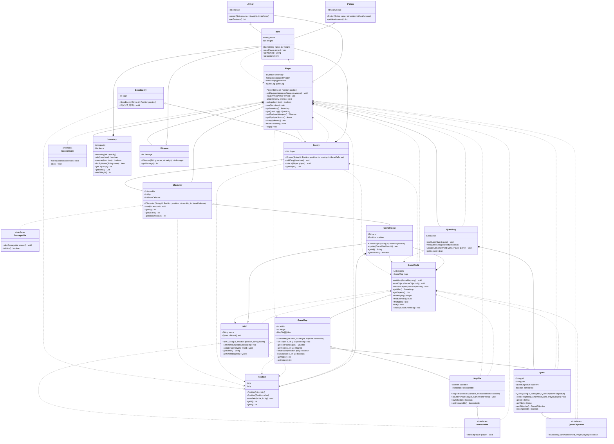

# 클래스 다이어그램

**생성 시간**: 2025-12-19 13:37:31

**프로젝트**: testjava2

**사용자 ID**: 1c8b252d-cd74-41d0-9191-59e1f93974dd

**포함된 클래스**: 전체

**클래스 수**: 21

**관계 수**: 52

---

```mermaid
classDiagram

    class `Armor` {
        -int defense
        +Armor(String name, int weight, int defense)
        +getDefense() int
    }

    class `BossEnemy` {
        -int rage
        +BossEnemy(String id, Position position)
        ~메서드명_미상() void
    }

    class `Character` {
        #int maxHp
        #int hp
        #int baseDefense
        #Character(String id, Position position, int maxHp, int baseDefense)
        +heal(int amount) void
        +getHp() int
        +getMaxHp() int
        +getBaseDefense() int
    }

    class `Damageable` {
        <<interface>>
        ~takeDamage(int amount) void
        ~isAlive() boolean
    }

    class `Enemy` {
        -List<Item> drops
        +Enemy(String id, Position position, int maxHp, int baseDefense)
        +addDrop(Item item) void
        +attack(Player player) void
        +getDrops() List<Item>
    }

    class `GameMap` {
        -int width
        -int height
        -MapTile[][] tiles
        +GameMap(int width, int height, MapTile defaultTile)
        +setTile(int x, int y, MapTile tile) void
        +getTile(Position pos) MapTile
        +getTile(int x, int y) MapTile
        +isWalkable(Position pos) boolean
        -inBounds(int x, int y) boolean
        +getWidth() int
        +getHeight() int
    }

    class `GameObject` {
        #String id
        #Position position
        #GameObject(String id, Position position)
        +update(GameWorld world) void
        +getId() String
        +getPosition() Position
    }

    class `GameWorld` {
        -List<GameObject> objects
        -GameMap map
        +setMap(GameMap map) void
        +addObject(GameObject obj) void
        +removeObject(GameObject obj) void
        +getMap() GameMap
        +getObjects() List<GameObject>
        +findPlayer() Player
        +findEnemies() List<Enemy>
        +findNpcs() List<NPC>
        +tick() void
        -cleanupDeadEnemies() void
    }

    class `IControllable` {
        <<interface>>
        ~move(Direction direction) void
        ~stop() void
    }

    class `Interactable` {
        <<interface>>
        ~interact(Player player) void
    }

    class `Inventory` {
        -int capacity
        -List<Item> items
        +Inventory(int capacity)
        +add(Item item) boolean
        +remove(Item item) boolean
        +findByName(String name) Item
        +getCapacity() int
        +getItems() List<Item>
        +totalWeight() int
    }

    class `Item` {
        #String name
        #int weight
        #Item(String name, int weight)
        +use(Player player) void
        +getName() String
        +getWeight() int
    }

    class `MapTile` {
        -boolean walkable
        -Interactable interactable
        +MapTile(boolean walkable, Interactable interactable)
        +onEnter(Player player, GameWorld world) void
        +isWalkable() boolean
        +getInteractable() Interactable
    }

    class `NPC` {
        -String name
        -Quest offeredQuest
        +NPC(String id, Position position, String name)
        +setOfferedQuest(Quest quest) void
        +update(GameWorld world) void
        +getName() String
        +getOfferedQuest() Quest
    }

    class `Player` {
        -Inventory inventory
        -Weapon equippedWeapon
        -Armor equippedArmor
        -QuestLog questLog
        +Player(String id, Position position)
        +setEquippedWeapon(Weapon weapon) void
        +equipArmor(Armor armor) void
        +attack(Enemy enemy) void
        +pickup(Item item) boolean
        +use(Item item) void
        +getInventory() Inventory
        +getQuestLog() QuestLog
        +getEquippedWeapon() Weapon
        +getEquippedArmor() Armor
        +unequipArmor() void
        -recalcDefense() void
        +stop() void
    }

    class `Position` {
        -int x
        -int y
        +Position(int x, int y)
        +Position(Position other)
        +translate(int dx, int dy) void
        +getX() int
        +getY() int
    }

    class `Potion` {
        -int healAmount
        +Potion(String name, int weight, int healAmount)
        +getHealAmount() int
    }

    class `Quest` {
        -String id
        -String title
        -QuestObjective objective
        -boolean completed
        +Quest(String id, String title, QuestObjective objective)
        +checkProgress(GameWorld world, Player player) void
        +getId() String
        +getTitle() String
        +getObjective() QuestObjective
        +isCompleted() boolean
    }

    class `QuestLog` {
        -List<Quest> quests
        +addQuest(Quest quest) void
        +hasQuest(String questId) boolean
        +updateAll(GameWorld world, Player player) void
        +getQuests() List<Quest>
    }

    class `QuestObjective` {
        <<interface>>
        ~isSatisfied(GameWorld world, Player player) boolean
    }

    class `Weapon` {
        -int damage
        +Weapon(String name, int weight, int damage)
        +getDamage() int
    }

    %% Relationships
    `Armor` <|-- `Item`
    `BossEnemy` <|-- `Enemy`
    `BossEnemy` ..> `Position`
    `Character` ..> `Position`
    `Character` <|-- `GameObject`
    `Character` <|.. `Damageable`
    `Enemy` ..> `Position`
    `Enemy` <|-- `Character`
    `Enemy` ..> `Player`
    `Enemy` ..> `GameWorld`
    `GameMap` ..> `Position`
    `GameObject` ..> `GameWorld`
    `GameWorld` ..> `Enemy`
    `GameWorld` ..> `Player`
    `GameWorld` ..> `NPC`
    `Interactable` ..> `Player`
    `Item` ..> `Player`
    `MapTile` ..> `Player`
    `MapTile` ..> `GameWorld`
    `NPC` ..> `Position`
    `NPC` <|-- `GameObject`
    `NPC` ..> `GameWorld`
    `NPC` <|.. `Interactable`
    `Player` ..> `Item`
    `Player` ..> `Enemy`
    `Player` ..> `Position`
    `Player` <|-- `Character`
    `Player` ..> `GameMap`
    `Player` <|.. `IControllable`
    `Potion` <|-- `Item`
    `Quest` ..> `Player`
    `Quest` ..> `GameWorld`
    `QuestLog` ..> `Player`
    `QuestLog` ..> `GameWorld`
    `QuestObjective` ..> `Player`
    `QuestObjective` ..> `GameWorld`
    `Weapon` <|-- `Item`
    `Enemy` *-- `Item`
    `GameMap` o-- `MapTile`
    `GameObject` *-- `Position`
    `GameWorld` *-- `GameObject`
    `GameWorld` o-- `GameMap`
    `Inventory` *-- `Item`
    `MapTile` o-- `Interactable`
    `NPC` o-- `Quest`
    `Player` o-- `Armor`
    `Player` *-- `Inventory`
    `Player` *-- `QuestLog`
    `Player` o-- `Weapon`
    `Quest` o-- `QuestObjective`
    `QuestLog` *-- `Quest`
```